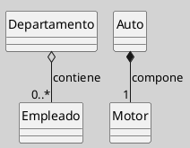

## Agregación vs. Composición

> La agregación y la composición son dos variantes de la relación todo-parte en UML que difieren en el grado de dependencia entre el todo y sus partes: mientras la primera admite partes con ciclo de vida autónomo, la segunda implica dependencia vital ([[Zk Ref boochLenguajeUnificadoModelado2006|Booch et al., 2006]]; [[Zk Ref omgUnifiedModelingLanguage2017|OMG, 2017]]).

### Diferencias Fundamentales

|Dimensión|Agregación|Composición|
|---|---|---|
|Símbolo|Rombo vacío (`o--`)|Rombo relleno (`*--`)|
|Ciclo de vida de las partes|Independiente del todo|Dependiente del todo|
|Propiedad|Compartida o no exclusiva|Exclusiva|
|Destrucción del todo|Las partes sobreviven|Las partes se destruyen|
|Multiplicidad típica del todo|Variable (`0..*`)|Generalmente `1`|
|Ejemplo canónico|Departamento – Empleado|Auto – Motor|

### Notación Comparativa

**Figura**  
_Comparación entre Agregación y Composición en UML_

_Nota_: El rombo vacío (agregación) indica que `Empleado` puede existir aunque `Departamento` sea eliminado; el rombo relleno (composición) indica que `Motor` se destruye junto con `Auto`._

### Criterio de Elección

[[Zk Ref boochLenguajeUnificadoModelado2006|Booch et al. (2006)]] señalan que la elección entre ambas formas depende de si las partes tienen significado independiente en el dominio del problema. Si una parte puede participar en múltiples todos o existir por sí sola, la agregación es la representación más fiel; si la parte carece de identidad fuera del contexto del todo, la composición captura mejor la semántica del dominio.

### Buenas Prácticas Compartidas

- Usar estas relaciones únicamente cuando la semántica todo-parte sea genuinamente relevante en el dominio; en caso contrario, una asociación simple es suficiente ([[Zk Ref omgUnifiedModelingLanguage2017|OMG, 2017]]).
    
- Documentar el criterio de elección en el modelo, especialmente cuando la distinción no sea evidente para los demás integrantes del equipo.
    
- Evitar el uso indiscriminado de composición como sinónimo de "contiene": no toda contención implica dependencia vital.
    

### Enlaces Sugeridos

- [[Zk Diagrama de Clases (Relaciones, Agregación)|Agregación]]
- [[Zk Diagrama de Clases (Relaciones, Composición)|Composición]]
- [[Zk Diagrama de Clases (Relaciones)|Relaciones: Visión General]]
