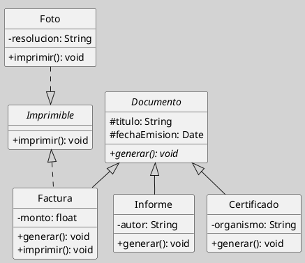

## Clase Abstracta vs. Interfaz

La distinción entre clase abstracta e interfaz es una de las decisiones conceptuales más importantes en el modelado orientado a objetos. Aunque ambas permiten declarar operaciones sin implementación concreta, no cumplen la misma función semántica en el diagrama de clases: la clase abstracta organiza una jerarquía con estructura común, mientras que la interfaz define un contrato de capacidades que puede ser realizado por clases de procedencias distintas ([[Zk Ref omgUnifiedModelingLanguage2017|OMG, 2017]]; [[Zk Ref rumbaughLenguajeUnificadoModelado2007|Rumbaugh et al., 2007]]).

### Diferencia Fundamental

La clase abstracta responde a una lógica de generalización. Su propósito es capturar el núcleo estructural y conductual que varias subclases comparten dentro de una misma familia conceptual. La interfaz, en cambio, responde a una lógica de contrato: expresa un conjunto de operaciones que una clase se compromete a ofrecer, sin implicar que forme parte de una jerarquía común ([[Zk Ref boochLenguajeUnificadoModelado2006|Booch et al., 2006]]; [[Zk Ref omgUnifiedModelingLanguage2017|OMG, 2017]]).

Dicho de otro modo, la clase abstracta sirve para modelar lo que varias clases son en común; la interfaz, para modelar lo que varias clases pueden hacer en común ([[Zk Ref rumbaughLenguajeUnificadoModelado2007|Rumbaugh et al., 2007]]; [[Zk Ref boochLenguajeUnificadoModelado2006|Booch et al., 2006]]).

### Comparación

| Aspecto | Clase Abstracta | Interfaz |
|---------|----------------|----------|
| **Naturaleza** | Superclase parcial ([[Zk Ref boochLenguajeUnificadoModelado2006\|Booch et al., 2006]]) | Contrato de comportamiento ([[Zk Ref omgUnifiedModelingLanguage2017\|OMG, 2017]]) |
| **Relación principal** | Generalización ([[Zk Ref rumbaughLenguajeUnificadoModelado2007\|Rumbaugh et al., 2007]]) | Realización ([[Zk Ref omgUnifiedModelingLanguage2017\|OMG, 2017]]) |
| **Atributos de instancia** | Puede tener ([[Zk Ref boochLenguajeUnificadoModelado2006\|Booch et al., 2006]]) | No, en UML estricto ([[Zk Ref omgUnifiedModelingLanguage2017\|OMG, 2017]]) |
| **Operaciones concretas** | Puede tener ([[Zk Ref rumbaughLenguajeUnificadoModelado2007\|Rumbaugh et al., 2007]]) | No ([[Zk Ref omgUnifiedModelingLanguage2017\|OMG, 2017]]) |
| **Operaciones abstractas** | Sí ([[Zk Ref rumbaughLenguajeUnificadoModelado2007\|Rumbaugh et al., 2007]]) | Sí ([[Zk Ref omgUnifiedModelingLanguage2017\|OMG, 2017]]) |
| **Propósito** | Factorizar estado y comportamiento común ([[Zk Ref boochLenguajeUnificadoModelado2006\|Booch et al., 2006]]) | Definir capacidades o servicios ([[Zk Ref omgUnifiedModelingLanguage2017\|OMG, 2017]]) |
| **Lugar en el modelo** | Dentro de una jerarquía ([[Zk Ref rumbaughLenguajeUnificadoModelado2007\|Rumbaugh et al., 2007]]) | Transversal a distintas jerarquías ([[Zk Ref omgUnifiedModelingLanguage2017\|OMG, 2017]]) |
| **Criterio de uso** | Clasificación y herencia estructural ([[Zk Ref boochLenguajeUnificadoModelado2006\|Booch et al., 2006]]) | Desacoplamiento y sustitución ([[Zk Ref omgUnifiedModelingLanguage2017\|OMG, 2017]]) |

### Criterio de Elección

La regla práctica puede formularse así ([[Zk Ref boochLenguajeUnificadoModelado2006|Booch et al., 2006]]; [[Zk Ref rumbaughLenguajeUnificadoModelado2007|Rumbaugh et al., 2007]]):

- Si el problema es de clasificación, herencia y estructura compartida, conviene una clase abstracta.
- Si el problema es de contrato, capacidad transversal o desacoplamiento, conviene una interfaz.

Esta distinción evita dos errores frecuentes: usar interfaces para modelar jerarquías conceptuales reales, o usar clases abstractas cuando lo que se necesita es un contrato reutilizable entre clases que no comparten una misma línea de herencia ([[Zk Ref omgUnifiedModelingLanguage2017|OMG, 2017]]; [[Zk Ref rumbaughLenguajeUnificadoModelado2007|Rumbaugh et al., 2007]]).

### Ejemplo Conceptual

`Documento` puede modelarse como clase abstracta cuando varias clases como `Factura`, `Informe` y `Certificado` comparten atributos como `titulo` o `fechaEmision`, y operaciones comunes que pertenecen a una misma familia conceptual. En cambio, `Imprimible` puede modelarse como interfaz cuando distintas clases, incluso ajenas entre sí en la jerarquía, deben ofrecer la operación `imprimir()` ([[Zk Ref boochLenguajeUnificadoModelado2006|Booch et al., 2006]]; [[Zk Ref rumbaughLenguajeUnificadoModelado2007|Rumbaugh et al., 2007]]).

Así, una `Factura` puede ser simultáneamente subclase de `Documento` y realizadora de `Imprimible`. La primera relación dice qué tipo de entidad es; la segunda, qué capacidad ofrece ([[Zk Ref omgUnifiedModelingLanguage2017|OMG, 2017]]).

**Figura**
*Ejemplo Conceptual*

### Error Frecuente

Un error habitual en el aprendizaje inicial consiste en pensar que la interfaz es simplemente “una clase abstracta más vacía”. Esa idea es insuficiente. La diferencia no es de cantidad de contenido, sino de función semántica en el modelo. La clase abstracta articula una familia; la interfaz articula un contrato ([[Zk Ref boochLenguajeUnificadoModelado2006|Booch et al., 2006]]; [[Zk Ref rumbaughLenguajeUnificadoModelado2007|Rumbaugh et al., 2007]]).

### Idea Final

La clase abstracta y la interfaz no son variantes menores de una misma idea, sino respuestas distintas a dos problemas distintos del modelado: organizar jerarquías con base común y definir contratos de comportamiento desacoplados ([[Zk Ref omgUnifiedModelingLanguage2017|OMG, 2017]]; [[Zk Ref boochLenguajeUnificadoModelado2006|Booch et al., 2006]]).

### Enlaces Sugeridos

- [[Zk Diagrama de Clases (Clases Abstractas)|Clases Abstractas]]
- [[Zk Diagrama de Clases (Elementos, Interfaces)|Interfaces]]
- [[Zk Diagrama de Clases (Relaciones, Generalización)|Generalización]]
- [[Zk Diagrama de Clases (Relaciones, Realización)|Realización]]
- [[Zk Herencia|Herencia]]
- [[Zk Polimorfismo|Polimorfismo]]
- [[Zk Orientación a Objetos como Paradigma de Análisis y Diseño|Orientación a Objetos]]