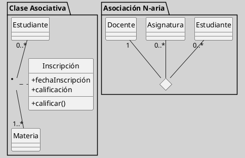

## Clase Asociativa vs Asociación N-Aria

Tanto la clase asociativa como la asociación n-aria extienden la semántica de la asociación binaria para capturar información que no pertenece a ninguna de las clases participantes por separado. Sin embargo, difieren en su estructura, notación y en el tipo de problema que modelan con mayor fidelidad ([[Zk Ref boochLenguajeUnificadoModelado2006|Booch et al., 2006]]; [[Zk Ref omgUnifiedModelingLanguage2017|OMG, 2017]]; [[Zk Ref rumbaughLenguajeUnificadoModelado2007|Rumbaugh et al., 2007]]).

### Distinción Conceptual

Una **clase asociativa** enriquece una asociación —generalmente binaria— con atributos y operaciones propios del vínculo. La asociación sigue siendo entre dos clases; lo que se agrega es una clase que la acompaña y le da identidad propia.

Una **asociación n-aria**, en cambio, involucra tres o más clases simultáneamente en una única asociación, porque la información que se desea registrar solo existe cuando todos los participantes están presentes al mismo tiempo. No se trata de enriquecer una asociación existente, sino de modelar un fenómeno que es irreductiblemente múltiple.

## Comparación Estructural

| Dimensión                          | Clase Asociativa                                                 | Asociación N-aria                                                               |
| ---------------------------------- | ---------------------------------------------------------------- | ------------------------------------------------------------------------------- |
| Número de clases participantes     | Generalmente dos (+ la clase asociativa)                         | Tres o más                                                                      |
| Notación UML                       | Línea de asociación + rectángulo vinculado por línea discontinua | Rombo sin relleno (nodo) + líneas hacia cada participante                       |
| Propósito                          | Añadir atributos/operaciones al vínculo entre dos clases         | Modelar una relación que requiere la participación simultánea de N clases       |
| ¿Puede llevar clase de asociación? | Es en sí misma la clase de asociación                            | Sí, como extensión opcional                                                     |
| Equivalencia posible               | Puede reescribirse como tres clases ordinarias                   | Puede intentarse binarizar, pero con posible pérdida semántica                  |
| Uso típico                         | `Inscripción` entre `Estudiante` y `Materia`                     | `Cursada` entre `Estudiante`, `Asignatura` y `Docente`                          |
| Complejidad de multiplicidad       | Similar a la asociación binaria                                  | Más compleja: se fijan N-1 participantes para leer la multiplicidad del N-ésimo |

### Comparación Visual

**Figura**  
_Clase Asociativa vs. Asociación N-aria: Comparación en un Único Diagrama_

*Nota*: a la izquierda, `Inscripción` es una clase asociativa que enriquece el vínculo binario `Estudiante–Materia`. A la derecha, el rombo `cursada` representa una asociación ternaria irreductible entre `Estudiante`, `Asignatura` y `Docente`.

### ¿Cuándo Usar Cada Una?

Usar **clase asociativa** cuando:

- La asociación es entre dos clases y el vínculo posee atributos u operaciones propios.
- La clase asociativa no necesita relacionarse con otras clases del modelo (si lo necesita, es preferible descomponerla en tres clases ordinarias; ver [[Zk Diagrama de Clases (Relaciones, Clases Asociativas)|Clases Asociativas]]).
    
Usar **asociación n-aria** cuando:

- La información a registrar solo existe si tres o más clases participan simultáneamente.
- La prueba de descomposición binaria produce ambigüedad o requiere clases artificiales sin correlato en el dominio.
    
### Advertencia Frecuente

Un error habitual es modelar como asociación n-aria lo que en realidad es una clase asociativa binaria con atributos. La prueba definitiva: si eliminar uno de los participantes hace que la asociación pierda sentido semántico completo —no solo información accidental— entonces la n-aria está justificada. Si la asociación sigue teniendo sentido entre dos de los participantes y el tercero solo aporta un atributo contextual, la clase asociativa es la representación correcta ([[Zk Ref boochLenguajeUnificadoModelado2006|Booch et al., 2006]]).

### Enlaces Sugeridos

- [[Zk Diagrama de Clases (Relaciones, Clases Asociativas)|Clases Asociativas]]
- [[Zk Diagrama de Clases (Relaciones, Asociaciones N-arias)|Asociaciones N-arias]]
- [[Zk Diagrama de Clases (Relaciones)|Relaciones: Visión General]]
- [[Zk Diagrama de Clases (Agregación vs. Composición)]]