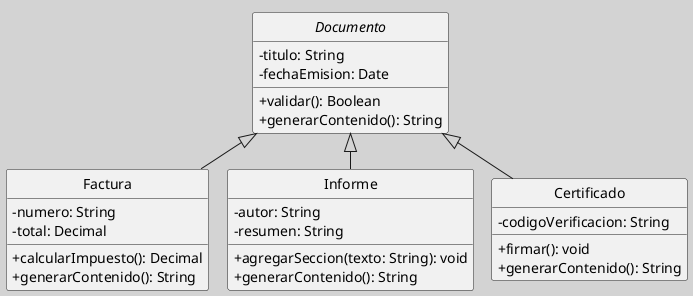

## Clases Abstractas

Una clase abstracta es una clase que no puede ser instanciada directamente. Su función consiste en representar un nivel general de la jerarquía conceptual del dominio, reuniendo atributos, operaciones y responsabilidades que varias subclases concretas comparten, pero que no corresponden por sí solos a un objeto independiente del sistema ([[Zk Ref boochLenguajeUnificadoModelado2006|Booch et al., 2006]]; [[Zk Ref omgUnifiedModelingLanguage2017|OMG, 2017]]).

En el diagrama de clases, la clase abstracta cumple una función de organización conceptual. Permite expresar que varias clases concretas son especializaciones de un concepto más general y evita repetir en cada una de ellas la estructura o el comportamiento que pertenece al nivel superior de la jerarquía.

### Definición y Propósito

La clase abstracta ocupa una posición intermedia entre la abstracción del dominio y la especificación estructural del modelo. No representa una entidad inexistente, sino una generalización legítima cuyo sentido aparece en sus especializaciones concretas. Por ello, su valor no reside en "dibujar una clase más", sino en factorizar con rigor aquello que varias clases comparten ([[Zk Ref boochLenguajeUnificadoModelado2006|Booch et al., 2006]]).

Desde la perspectiva del análisis y diseño orientado a objetos, una clase abstracta es útil cuando existe una relación clara de generalización y especialización. Si varias clases pueden entenderse como variantes de un mismo concepto, y además comparten atributos u operaciones relevantes, la clase abstracta ofrece el lugar natural para modelar ese núcleo común ([[Zk Ref rumbaughLenguajeUnificadoModelado2007|Rumbaugh et al., 2007]]).

### Notación UML

En UML, una clase abstracta puede representarse de dos formas equivalentes:

1. Escribiendo el nombre de la clase en *cursiva*.
2. Añadiendo la restricción `{abstract}` al nombre de la clase.

Del mismo modo, una operación abstracta puede escribirse en cursiva o marcarse explícitamente como abstracta. En ambos casos, el significado es el mismo: la operación forma parte del contrato de la jerarquía, pero su implementación queda a cargo de las subclases concretas ([[Zk Ref rumbaughLenguajeUnificadoModelado2007|Rumbaugh et al., 2007]]).

### Qué Puede Contener

Una clase abstracta puede contener elementos concretos y abstractos al mismo tiempo. Esta combinación es precisamente lo que le da flexibilidad como mecanismo de modelado.

Puede incluir:

- Atributos concretos, heredables por todas las subclases.
- Operaciones concretas, comunes a toda la jerarquía.
- Operaciones abstractas, que las subclases deben implementar.
- Restricciones, responsabilidades o reglas que definan el marco general de la familia de clases.

En consecuencia, una clase abstracta no es una interfaz disfrazada. Tiene mayor densidad estructural y semántica, porque no solo declara un contrato: también puede encapsular estado y comportamiento compartido.

### Cuándo Conviene Utilizarla

Conviene utilizar una clase abstracta cuando el modelo necesita representar una categoría general del dominio que no debe instanciarse directamente, pero que organiza una familia de clases concretas. El criterio rector es que la superclase abstracta debe expresar un concepto auténtico, no una conveniencia gráfica ([[Zk Ref boochLenguajeUnificadoModelado2006|Booch et al., 2006]]).

También resulta apropiada cuando se quiere desplazar hacia un nivel superior los elementos comunes de varias clases, simplificando las subclases y haciendo más explícita la estructura de la jerarquía. Esta decisión mejora la legibilidad del modelo y favorece la reutilización conceptual y técnica ([[Zk Ref rumbaughLenguajeUnificadoModelado2007|Rumbaugh et al., 2007]]).

### Relación con Generalización y Polimorfismo

La clase abstracta está estrechamente ligada a la [[Zk Diagrama de Clases (Relaciones, Generalización)|generalización]]. Las subclases concretas heredan sus atributos y operaciones, y pueden además extenderlas o redefinirlas según sus necesidades específicas.

Su utilidad crece todavía más cuando se la considera junto con el [[Zk Polimorfismo|polimorfismo]]. Una referencia del tipo abstracto puede aludir a objetos de distintas subclases concretas, permitiendo que el sistema opere sobre el concepto general sin depender de una implementación específica. Así, la variabilidad del dominio queda absorbida por la jerarquía y no dispersa en lógica condicional externa ([[Zk Ref boochLenguajeUnificadoModelado2006|Booch et al., 2006]]).

### Distinción Conceptual

La diferencia entre clase abstracta e interfaz no se reduce a una cuestión sintáctica, sino a dos decisiones de modelado distintas: una organiza jerarquías con estructura compartida y la otra define contratos de capacidades. Para un desarrollo comparativo, véase [[Zk Diagrama de Clases (Clase Abstracta vs. Interfaz)|Clase Abstracta vs. Interfaz]].

### Ejemplo

Un ejemplo pedagógicamente claro es la jerarquía de documentos administrativos. En muchos sistemas, `Documento` no existe como objeto concreto aislado; lo que existen son facturas, informes, constancias o certificados. Sin embargo, todas estas clases comparten propiedades y responsabilidades suficientes como para justificar una clase abstracta común.

**Figura**
_Jerarquía de Documentos Administrativos_

*Nota*: En este ejemplo, `Documento` concentra atributos y operaciones comunes a toda la jerarquía. Las clases `Factura`, `Informe` y `Certificado` heredan esa base, pero especializan el comportamiento según su naturaleza propia. La operación `generarContenido()` muestra con claridad la función de la abstracción: todas las subclases deben poder generar contenido, pero no lo hacen del mismo modo.

### Enlaces Sugeridos

- [[Zk Diagrama de Clases (Elementos, Clases)|Clases en el Diagrama de Clases]]
- [[Zk Diagrama de Clases (Relaciones, Generalización)|Generalización]]
- [[Zk Diagrama de Clases (Elementos, Interfaces)|Interfaces]]
- [[Zk Diagrama de Clases (Relaciones, Realización)|Realización de Interfaces]]
- [[Zk Herencia|Herencia]]
- [[Zk Polimorfismo|Polimorfismo]]
- [[Zk Modelo Conceptual del UML (Reglas) Visibilidad|Visibilidad en UML]]
- [[Zk Orientación a Objetos como Paradigma de Análisis y Diseño|Orientación a Objetos]]