```plantuml-code
@startuml
!pragma layout smetana
skinparam style strictuml
skinparam classAttributeIconSize 0
skinparam BackgroundColor LightGray
left to right direction
'top to bottom direction
skinparam linetype ortho
scale 1

class SensorTérmico {
  #leerTemperatura(escala: Escala = Celsius): float
  +activarAlerta(umbral: float): void
}
@enduml
```

## Diagrama de Clases (Elemento, Clase - Operaciones, Métodos)

Las **operaciones** definen los servicios que una clase ofrece, mientras los **métodos** especifican su implementación concreta. Este zettel detalla su sintaxis, tipos y buenas prácticas para modelar comportamientos en UML[[Zk Ref omgUnifiedModelingLanguage2017|(OMG, 2017)]].

### Operación vs. Método

| Operación                                                                                                                      | Método                                                                                                                                        |
| ------------------------------------------------------------------------------------------------------------------------------ | --------------------------------------------------------------------------------------------------------------------------------------------- |
| Declaración abstracta de un servicio que una clase ofrece a su entorno [[Zk Ref omgUnifiedModelingLanguage2017\|(OMG, 2017)]]. | Implementación concreta de una operación en un lenguaje específico [[Zk Ref rumbaughLenguajeUnificadoModelado2007\|(Rumbaugh et al., 2007)]]. |

**Figura**
_Ejemplo de la Representación las Operaciones de una Clase CuentaBancaria_



```plantuml-code
@startuml
!pragma layout smetana
skinparam style strictuml
skinparam classAttributeIconSize 0
skinparam BackgroundColor LightGray
left to right direction
'top to bottom direction
skinparam linetype ortho
scale 1

class CuentaBancaria {
  +depositar(monto: double): void
  +retirar(monto: double): boolean
  +consultarSaldo(): double
}
@enduml
```

*Nota*: Las operaciones se listan en el tercer compartimento de la clase. Cada una incluye:
- **Visibilidad** (`+` público, `-` privado, `#` protegido).
- **Nombre**
- **Parámetros** (nombre: tipo)
 - **Tipo de retorno** (opcional)

### Sintaxis Detallada

**Forma Canónica**
`visibilidad nombreOperación (parámetro1: tipo, parámetro2: tipo = valorPredeterminado): tipoRetorno`

**Ejemplo de Firma de Operación**

**Figura**
_Ejemplo de la Representación la Operación de una Clase_





### Tipos de Operaciones

| Tipo            | Descripción                                   | Ejemplo                             |
| --------------- | --------------------------------------------- | ----------------------------------- |
| **Constructor** | Inicializa objetos (`<<create>>`)             | `+ crearCliente(nombre: String)`    |
| **Query**       | No modifican estado (sin efectos secundarios) | `+ obtenerEdad(): int`              |
| **Signal**      | Disparan eventos asincrónicos                 | `+ notificarError(mensaje: String)` |

## Métodos y Sobreescritura

**Implementación en Clases Hijas**

**Figura**
_Ejemplo Implementación en Clases Hijas_



```plantuml-code
@startuml
!pragma layout smetana
skinparam style strictuml
skinparam classAttributeIconSize 0
skinparam BackgroundColor LightGray
left to right direction
'top to bottom direction
skinparam linetype ortho
scale 1

class Figura {
  +dibujar(): void
}
class Circulo {
  +dibujar(): void
}
Figura <|-- Circulo
@enduml
```

_Nota_: El método `dibujar()` en `Circulo` puede sobreescribir el de `Figura`.


---
## Operaciones y Métodos en el Diagrama de Clases

En UML, las **operaciones** definen los servicios que una clase ofrece a su entorno; los **métodos** son su contraparte de implementación: la realización concreta de una operación en un contexto específico. La distinción es fundamental para separar la especificación del comportamiento de su realización ([[Zk Ref omgUnifiedModelingLanguage2017|OMG, 2017]]; [[Zk Ref boochLenguajeUnificadoModelado2006|Booch et al., 2006]]).

### Operación vs. Método

|                   | Operación                                                              | Método                                                                        |
| ----------------- | ---------------------------------------------------------------------- | ----------------------------------------------------------------------------- |
| **Naturaleza**    | Declaración abstracta de un servicio que una clase ofrece a su entorno | Implementación concreta de una operación en un lenguaje o contexto específico |
| **Nivel**         | Especificación (modelo)                                                | Realización (implementación)                                                  |
| **Corresponde a** | Firma: nombre, parámetros, tipo de retorno                             | Cuerpo: algoritmo o procedimiento que ejecuta la operación                    |
| **En UML**        | Se lista en el tercer compartimento del rectángulo de clase            | Se asocia a la operación; puede variar por clase concreta en una jerarquía    |
Una operación puede no tener método asociado —cuando es abstracta— o tener múltiples métodos en distintas subclases —cuando es polimórfica ([[Zk Ref rumbaughLenguajeUnificadoModelado2007|Rumbaugh et al., 2007]]).

### Notación

Las operaciones se listan en el tercer compartimento del rectángulo de clase. Cada entrada puede incluir visibilidad, nombre, lista de parámetros y tipo de retorno.

**Figura**
_Ejemplo de la Representación las Operaciones de una Clase CuentaBancaria_


```plantuml-code
!pragma layout smetana
skinparam style strictuml
skinparam classAttributeIconSize 0
skinparam BackgroundColor LightGray
left to right direction
skinparam linetype ortho
scale 1

class CuentaBancaria {
  +depositar(monto: double): void
  +retirar(monto: double): boolean
  +consultarSaldo(): double
}
```

### Sintaxis Canónica

La forma general de una operación en UML es:

> `visibilidad nombreOperación (parámetro1: tipo, parámetro2: tipo = valorPredeterminado): tipoRetorno`

#### Visibilidad

| Símbolo | Significado |
| ------- | ----------- |
| `+`     | público     |
| `-`     | privado     |
| `#`     | protegido   |
#### Parámetros

Cada parámetro sigue la forma `nombre: Tipo [= valorPredeterminado]`. La dirección del parámetro puede especificarse opcionalmente con las palabras clave `in`, `out` o `inout`, cuando es relevante para la especificación del contrato ([[Zk Ref omgUnifiedModelingLanguage2017|OMG, 2017]]).

#### Propiedades de Operación

| Propiedad       | Significado                                                                                         |
| --------------- | --------------------------------------------------------------------------------------------------- |
| `{query}`       | La operación no modifica el estado del objeto; equivale a una función pura.                         |
| `{abstract}`    | No tiene implementación en la clase que la declara; debe ser realizada por las subclases concretas. |
| `{static}`      | Pertenece al clasificador, no a cada instancia; se subraya en la notación gráfica.                  |
| `{redefines x}` | Redefine la operación heredada `x`.                                                                 |
| `{ordered}`     | Aplicable a parámetros de retorno de tipo colección; los elementos mantienen orden.                 |

#### Ejemplo de Firma con Parámetro por Defecto

**Figura**
_Ejemplo de la Representación la Operación de una Clase_


```plantuml-code
!pragma layout smetana
skinparam style strictuml
skinparam classAttributeIconSize 0
skinparam BackgroundColor LightGray
left to right direction
skinparam linetype ortho
scale 1

class SensorTérmico {
  #leerTemperatura(escala: Escala = Celsius): float
  +activarAlerta(umbral: float): void
}
```

### Tipos de Operaciones

| Tipo            | Descripción                                                                        | Estereotipo UML                    |
| --------------- | ---------------------------------------------------------------------------------- | ---------------------------------- |
| **Constructor** | Inicializa una nueva instancia del clasificador                                    | «create»                           |
| **Destructor**  | Libera los recursos asociados a una instancia                                      | «destroy»                          |
| **Query**       | No modifica el estado del objeto; carece de efectos secundarios observables        | `{query}`                          |
| **Modificador** | Altera el estado interno del objeto                                                | —                                  |
| **Abstracta**   | Declarada sin implementación; obliga a las subclases concretas a proveer un método | `{abstract}` o nombre en *cursiva* |
| **Estática**    | Pertenece al clasificador; no requiere instancia para invocarse                    | `{static}`                         |
| **Signal**      | Dispara un evento asincrónico hacia otro objeto                                    | «signal»                           |

### Sobreescritura y Polimorfismo

Cuando una subclase provee su propio método para una operación declarada en la superclase, se produce la **sobreescritura** (*override*). La operación mantiene la misma firma; el método varía según el tipo concreto del objeto receptor. Este mecanismo es la base del [[Zk Polimorfismo|polimorfismo]] de subtipo en UML ([[Zk Ref boochLenguajeUnificadoModelado2006|Booch et al., 2006]]).

**Figura**
_Ejemplo Implementación en Clases Hijas_


```plantuml-code
!pragma layout smetana
skinparam style strictuml
skinparam classAttributeIconSize 0
skinparam BackgroundColor LightGray
left to right direction
skinparam linetype ortho
scale 1

class Figura {
  +dibujar(): void
}
class Circulo {
  +dibujar(): void
}
Figura <|-- Circulo
```

La operación `dibujar()` está declarada en `Figura`; `Circulo` provee su propio método con la misma firma, especializando el comportamiento heredado.

### Buenas Prácticas

- Declarar las operaciones con el nivel de visibilidad mínimo necesario.
- Marcar explícitamente las operaciones que no modifican estado con `{query}` para facilitar el razonamiento sobre efectos secundarios.
- Indicar `{abstract}` en operaciones sin implementación para hacer explícito el contrato con las subclases.
- Evitar listas de parámetros excesivamente largas; cuando superen tres o cuatro parámetros, considerar la introducción de un objeto parámetro.
- Nombrar las operaciones con verbos en infinitivo que expresen claramente la acción o el servicio ofrecido.
- Preferir algún estándar de codificación de nombres como: [[Zk Convenciones para Nombres de Variables y Otros|camelCase, sneake_case, etc.]]

### Conexiones

- [[Zk Diagrama de Clases (Elementos, Clases)|Clases en el Diagrama de Clases]]
- [[Zk Diagrama de Clases (Elemento, Clase - Atributos)|Atributos en el Diagrama de Clases]]
- [[Zk Diagrama de Clases (Clases Abstractas)|Clases Abstractas]]
- [[Zk Modelo Conceptual del UML (Reglas) Visibilidad|Visibilidad en UML]]
- [[Zk Polimorfismo|Polimorfismo]]
- [[Zk Diagrama de Clases (Relaciones, Generalización)|Generalización]]
