## Atributos en el Diagrama de Clases

Los atributos son propiedades estructurales de una clase que especifican el rango de valores que cada instancia puede almacenar. Su correcta definición es condición necesaria para la integridad, la legibilidad y la reutilización del modelo ([[Zk Ref omgUnifiedModelingLanguage2017|OMG, 2017]]).

### Definición

Un atributo especifica una propiedad estructural de un clasificador: declara que cada instancia posee un valor —o conjunto de valores— del tipo indicado. En la notación gráfica UML, los atributos se listan en el segundo compartimento del rectángulo de clase, inmediatamente debajo del nombre ([[Zk Ref rumbaughLenguajeUnificadoModelado2007|Rumbaugh et al., 2007]]).

### Sintaxis

La forma canónica de un atributo en UML es:

`visibilidad nombre: Tipo [= valorPorDefecto] {propiedades}`

#### Visibilidad

| Símbolo | Significado |
| ------- | ----------- |
| `+`     | público     |
| `-`     | privado     |
| `#`     | protegido   |

**Notaciones Especiales**

- **Atributo derivado** (`/`): el prefijo `/` antepuesto al nombre indica que el valor no se almacena de forma independiente, sino que se obtiene mediante cálculo o inferencia a partir de otros atributos o relaciones del clasificador. La regla de derivación puede especificarse mediante una restricción OCL o dejarse implícita cuando es evidente en el contexto del dominio. Que el valor sea derivado no impide que esté materializado (*cached*) en la implementación; lo que UML expresa es una restricción semántica: el atributo es funcionalmente dependiente de otros datos del modelo ([[Zk Ref omgUnifiedModelingLanguage2017|OMG, 2017]]; [[Zk Ref boochLenguajeUnificadoModelado2006|Booch et al., 2006]]).
  
- **Atributo estático** (`{static}`): compartido por todas las instancias de la clase; en la representación gráfica se subraya el nombre.

#### Multiplicidad

La multiplicidad indica cuántos valores puede almacenar el atributo y se escribe entre corchetes tras el tipo. Por ejemplo, `telefono: String[*]` declara una colección de tamaño no acotado ([[Zk Ref omgUnifiedModelingLanguage2017|OMG, 2017]]).

#### Valor por Defecto

Se especifica a continuación del signo "="  y representa el valor que toma el atributo al crear una instancia si no se provee otro explícitamente ([[Zk Ref omgUnifiedModelingLanguage2017|OMG, 2017]]).

#### Valores Etiquetados

Los valores etiquetados (*tagged values*) son pares `{clave = valor}` que permiten añadir información suplementaria a un elemento del modelo sin alterar su semántica UML estándar. En el contexto de los atributos, se escriben entre llaves al final de la declaración y pueden expresar restricciones, intenciones de implementación o metadatos del proceso de modelado ([[Zk Ref omgUnifiedModelingLanguage2017|OMG, 2017]]).

Algunos valores etiquetados de uso frecuente en atributos son: 

| Valor etiquetado | Significado                                                                                |
| ---------------- | ------------------------------------------------------------------------------------------ |
| `{readOnly}`     | El atributo no puede modificarse una vez asignado.                                         |
| `{ordered}`      | Los valores del atributo mantienen un orden definido.                                      |
| `{unique}`       | No se permiten valores duplicados en la colección.                                         |
| `{static}`       | El atributo pertenece al clasificador, no a cada instancia.                                |
| `{derived}`      | El valor se calcula a partir de otros elementos del modelo; equivalente a la notación `/`. |
Los valores etiquetados son [[Zk Modelo Conceptual del UML (Mecanismos Comunes)|mecanismos de extensión]] del metamodelo UML; su interpretación y efecto concreto dependen de la herramienta de modelado o del perfil UML aplicado ([[Zk Ref boochLenguajeUnificadoModelado2006|Booch et al., 2006]]).

#### Ejemplo Básico

**Figura**
_Ejemplo de la Representación de Atributos_

```plantuml-code
@startuml
!pragma layout smetana
skinparam style strictuml
skinparam classAttributeIconSize 0
skinparam BackgroundColor LightGray
left to right direction
'top to bottom direction
skinparam linetype ortho
scale 1

class Producto {
  - id: int
  - precio: double
  - stock: int
  / disponible: boolean
  {static} totalProductos: int
}

@enduml
```

La clase `Producto` ilustra los casos más relevantes:
- `- id: int`, `- precio: double`, `- stock: int`: atributos privados de instancia.
- `/ disponible: boolean`: atributo derivado; su valor es `verdadero` si y solo si `stock > 0`.
- `{static} totalProductos: int`: atributo estático; registra la cantidad de instancias creadas, con independencia de cualquier objeto particular.

### Ejemplo Avanzado

![[Zk Ejemplo de Especificación de UI con UML]]

### Buenas Prácticas

- Declarar los atributos con visibilidad privada (`-`) y exponer el acceso mediante operaciones.
- Especificar la multiplicidad cuando el atributo admite más de un valor.
- Documentar la regla de derivación de los atributos derivados, preferentemente mediante [[Zk Object Constrain Language (OCL)|OCL]] o con una nota.
- Nombrar los atributos de forma clara, consistente y en el idioma del dominio del modelo.
- Preferir algún estándar de codificación de nombres como: [[Zk Convenciones para Nombres de Variables y Otros|camelCase, sneake_case, etc.]]

### Conexiones Sugeridas

- [[Zk Diagrama de Clases (Elementos, Clases)|Clases en el Diagrama de Clases]]
- [[Zk Diagrama de Clases (Elemento, Clase -  Operaciones, Métodos)|Operaciones en el Diagrama de Clases]]
- [[Zk Modelo Conceptual del UML (Reglas) Visibilidad|Visibilidad en UML]]
- [[Zk UML - Multiplicidad|Multiplicidad en UML]]

