## Diagrama de Clases (Elementos - Clases)

> La [[Zk Modelo Conceptual del UML (Elementos Estructurales)#Clase|clase]] es uno de los elementos estructurales de los [[Zk Modelo Conceptual del UML#Bloques Básicos de Construcción|bloques básicos de construcción]] del UML y es fundamental para el [[Zk Diagrama de Clases (Introducción, Definición, Características y sus Usos)|diagrama de clases]].

### Clase

Una **clase** es una descripción abstracta de un conjunto de objetos que comparten atributos, operaciones, relaciones y semántica. Se representa mediante un rectángulo dividido en tres compartimentos: nombre, atributos y operaciones [[Zk Ref omgUnifiedModelingLanguage2017|(OMG, 2017)]].

#### Sintaxis

**Figura**
_Ejemplo de una Clase_

```plantuml-code
@startuml 
!pragma layout smetana
skinparam style strictuml
skinparam classAttributeIconSize 0
skinparam BackgroundColor LightGray
left to right direction
'top to bottom direction
skinparam linetype ortho
scale 1

class CuentaBancaria {
  -saldo: double
  -numeroCuenta: String
  +depositar(monto: double): void
  +obtenerSaldo(): double
}

@enduml
```

_Nota_:
- **Nombre:** En negrita, centrado en el primer compartimento. Debe ser único dentro del modelo.
- **Atributos:** Se escriben en el segundo compartimento. Incluyen su [[Zk Visibilidad en UML|visibilidad]] (`-` privado, `+`público, `#` protegido), nombre, tipo (opcional), valor inicial (opcional), y pueden incluir valores etiquetados y restricciones.
- **Operaciones:** Se ubican en el tercer compartimento. Incluyen [[Zk Visibilidad en UML|visibilidad]], nombre, lista de parámetros (nombre: tipo), tipo de retorno (opcional) y pueden tener restricciones asociadas.
- **Compartimentos:** Los compartimentos de atributos y operaciones son opcionales; pueden omitirse para simplificar el diagrama, siempre que su información no sea relevante para el modelo.

#### #### Mecanismo de Extensibilidad

La clase en UML puede aprovechar los mecanismos de [[Zk Modelo Conceptual del UML (Mecanismos Comunes, Estereotipo)|estereotipos]], valores etiquetados y restricciones para adaptar y enriquecer la semántica de los modelos ([[Zk Ref omgUnifiedModelingLanguage2017|OMG, 2017]]).

Los estereotipos permiten extender la semántica de una clase sin modificar el metamodelo. Para el catálogo completo de estereotipos de clase usados en el análisis y diseño orientado a objetos, véase [[Zk Diagrama de Clases (Elementos, Estereotipos de Clase)|Estereotipos de Clase]].

### Consideraciones Adicionales

- Las **restricciones** sobre atributos y operaciones pueden expresarse en OCL (*Object Constraint Language*) o mediante notas en el diagrama ([[Zk Ref omgUnifiedModelingLanguage2017|OMG, 2017]]). Ver [[Zk Modelo Conceptual del UML (Mecanismos Comunes, Restricción)|Restricciones en UML]].
- Los **valores etiquetados** permiten añadir metadatos personalizados a los elementos del modelo ([[Zk Ref omgUnifiedModelingLanguage2017|OMG, 2017]]). Ver [[Zk Modelo Conceptual del UML (Mecanismos Comunes, Valor Etiquetado)|Valores Etiquetados en UML]].

### Enlaces Sugeridos

[[Zk Diagrama de Clases (Elementos, Interfaces)|Interfaces]]
