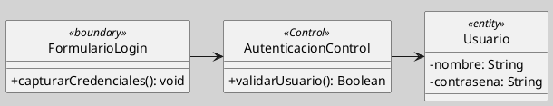
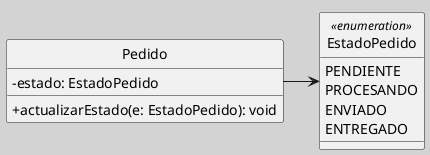

## Estereotipos de Clase

Los estereotipos de clase extienden la semántica del clasificador UML sin modificar el metamodelo. En el análisis y diseño orientado a objetos, los más usados son los del [[Zk Análisis de Robustez en el Proceso de Análisis y Diseño Orientado a Objetos|análisis de robustez]] (`«boundary»`, `«control»`, `«entity»`) y los tipos de valor (`«enumeration»`). Cada uno señala el rol estructural o conductual que la clase cumple en el sistema ([[Zk Ref omgUnifiedModelingLanguage2017|OMG, 2017]]).

### Definición

Un [[Zk Modelo Conceptual del UML (Mecanismos Comunes, Estereotipo)|estereotipos]] es un mecanismo de extensibilidad del UML que permite clasificar elementos del modelo con una semántica adicional predefinida. Aplicado a una clase, el estereotipo se representa con el nombre entre guillemets (`«»`) en el compartimento superior, encima del nombre de la clase ([[Zk Ref omgUnifiedModelingLanguage2017|OMG, 2017]]).

### Estereotipos del Análisis de Robustez

Los tres estereotipos del análisis de robustez fueron introducidos por Jacobson et al. ([[Zk Ref jacobsonObjectOrientedSoftwareEngineering1992|1992]]) como categorías de clasificación de objetos en el análisis orientado a objetos y fueron luego adoptados por UML:

`«boundary»`

Designa una clase que actúa como punto de contacto entre el sistema y un actor externo. Gestiona la comunicación entrante y saliente, pero no contiene lógica de negocio ni estado persistente ([[Zk Ref jacobsonObjectOrientedSoftwareEngineering1992|Jacobson et al., 1992]]).

`«control»`

Designa una clase que encapsula la lógica de coordinación de un caso de uso o proceso. Orquesta la interacción entre objetos de frontera y de entidad, concentrando las decisiones de flujo que no pertenecen naturalmente a ninguno de ellos ([[Zk Ref jacobsonObjectOrientedSoftwareEngineering1992|Jacobson et al., 1992]]).

`«entity»` ^c4b52a

Designa una clase que representa información relevante para el negocio, típicamente con ciclo de vida persistente más allá de una interacción individual. Corresponde, en muchos casos, a objetos que serán almacenados en una base de datos ([[Zk Ref jacobsonObjectOrientedSoftwareEngineering1992|Jacobson et al., 1992]]).

**Figura**
*Los tres estereotipos del análisis de robustez*

*Nota*: `FormularioLogin` gestiona la interacción con el actor; `AutenticacionControl` orquesta la lógica del caso de uso; `Usuario` encapsula el estado persistente del negocio.

`«enumeration»`

Designa un clasificador cuyos valores son un conjunto cerrado y nombrado de literales. En UML, una enumeración es un tipo de dato primitivo extendido; sus instancias son los propios literales, no objetos en el sentido pleno del término ([[Zk Ref omgUnifiedModelingLanguage2017|OMG, 2017]]).

**Figura**
*Enumeración como tipo de dato*

### Buenas Prácticas

- Aplicar estereotipos solo cuando aporten semántica real al modelo; usarlos indiscriminadamente sobrecarga el diagrama sin beneficio ([[Zk Ref omgUnifiedModelingLanguage2017|OMG, 2017]]).
- En modelos de análisis, los estereotipos de robustez (`«boundary»`, `«control»`, `«entity»`) ayudan a distribuir responsabilidades antes de pasar al diseño detallado ([[Zk Ref jacobsonObjectOrientedSoftwareEngineering1992|Jacobson et al., 1992]]).
- Las enumeraciones deben usarse cuando el conjunto de valores es cerrado y estable; si los valores pueden cambiar en tiempo de ejecución, una clase concreta es más adecuada ([[Zk Ref omgUnifiedModelingLanguage2017|OMG, 2017]]).

### Enlaces Sugeridos

- [[Zk Diagrama de Clases (Elementos, Clases)|Clases en el Diagrama de Clases]]
- [[Zk Modelo Conceptual del UML (Mecanismos Comunes, Estereotipo)|Estereotipos en el Metamodelo UML]]
- [[Zk Diagrama de Clases (Relaciones, Dependencia)|Dependencia]]
- [[Zk !MOC Diagrama de Clases (Fundamentos, Elementos, Relaciones, etc.)|Diagrama de Clases: Fundamentos, Elementos y Relaciones]]
