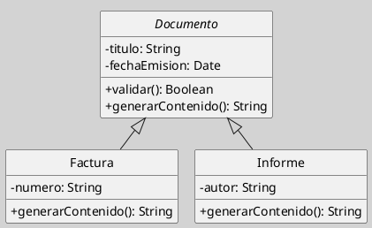
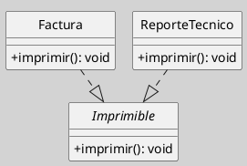
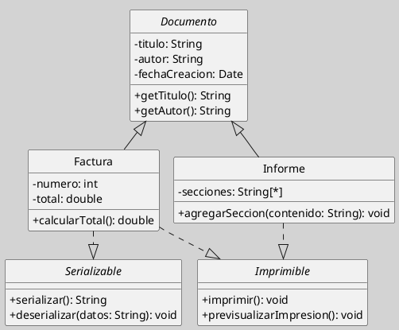

## Interfaces en el Diagrama de Clases

Una interfaz es un clasificador que declara un conjunto de operaciones, y eventualmente propiedades o señales, que constituyen un contrato de comportamiento sin aportar implementación propia. En el diagrama de clases, su función principal es expresar capacidades o servicios que pueden ser asumidos por clases distintas, incluso cuando no pertenecen a una misma jerarquía conceptual ([[Zk Ref boochLenguajeUnificadoModelado2006|Booch et al., 2006]]; [[Zk Ref omgUnifiedModelingLanguage2017|OMG, 2017]]).

La interfaz separa de manera explícita el qué del cómo. Define qué servicios deben estar disponibles para otros elementos del sistema, pero no especifica cómo serán realizados internamente. Esta distinción la convierte en una pieza clave para el desacoplamiento, la sustituibilidad y la modularidad del diseño orientado a objetos ([[Zk Ref rumbaughLenguajeUnificadoModelado2007|Rumbaugh et al., 2007]]).

### Definición y Sentido Conceptual

Desde el punto de vista semántico, la interfaz no modela una categoría del dominio en el mismo sentido que una clase o una clase abstracta. Su función no es clasificar entidades, sino declarar un contrato de comportamiento que otras clases pueden comprometerse a cumplir. Por ello, la interfaz responde a la lógica de “qué puede hacer un elemento” más que a la lógica de “qué tipo de elemento es” ([[Zk Ref omgUnifiedModelingLanguage2017|OMG, 2017]]).

Esta característica la vuelve especialmente útil cuando el sistema necesita modelar capacidades transversales. Clases conceptualmente distintas pueden realizar la misma interfaz si todas ofrecen el conjunto de operaciones definido por ese contrato. El valor de la interfaz reside, por tanto, en abstraer servicios visibles sin comprometer una implementación específica.

### Notación en UML

UML admite dos formas principales de representar interfaces:

1. **Notación expandida**, mediante un rectángulo similar al de una clase con el estereotipo `<<interface>>`, lo que permite listar explícitamente las operaciones declaradas.
2. **Notación compacta o lollipop**, mediante un pequeño círculo unido a la clase o componente que provee la interfaz; esta forma es más frecuente en diagramas de componentes y arquitecturas de alto nivel ([[Zk Ref omgUnifiedModelingLanguage2017|OMG, 2017]]).

En el diagrama de clases, la relación entre una clase concreta y una interfaz se expresa normalmente mediante una **realización**, representada con una línea discontinua y un triángulo hueco apuntando hacia la interfaz. Esta notación indica que la clase se compromete a implementar el contrato definido por aquella ([[Zk Ref boochLenguajeUnificadoModelado2006|Booch et al., 2006]]; [[Zk Ref omgUnifiedModelingLanguage2017|OMG, 2017]]).

### Distinción Conceptual

La diferencia entre clase abstracta e interfaz no se reduce a una cuestión sintáctica, sino a dos decisiones de modelado distintas: una organiza jerarquías con estructura compartida y la otra define contratos de capacidades ([[Zk Ref omgUnifiedModelingLanguage2017|OMG, 2017]]; [[Zk Ref rumbaughLenguajeUnificadoModelado2007|Rumbaugh et al., 2007]]).

**Figura**
*Clase Abstracta Como Factor común en la Jerarquía*

*Nota*: En este primer caso, `Documento` organiza una familia conceptual y concentra estructura común. La relación principal es de generalización: `Factura` e `Informe` son tipos de `Documento` ([[Zk Ref boochLenguajeUnificadoModelado2006|Booch et al., 2006]]).

**Figura**
*Interfaz como contrato de capacidad*

*Nota*: En este segundo caso, `Imprimible` no organiza una jerarquía de tipos, sino un contrato de comportamiento. `Factura` y `ReporteTecnico` no necesitan pertenecer a la misma familia conceptual para realizar la misma interfaz; basta con que ambas ofrezcan la capacidad `imprimir()` ([[Zk Ref omgUnifiedModelingLanguage2017|OMG, 2017]]).

Para el desarrollo comparativo sistemático, véase [[Zk Diagrama de Clases (Clase Abstracta vs. Interfaz)|Clase Abstracta vs. Interfaz]].

### Relación de Realización

La interfaz aparece estrechamente ligada a la relación de [[Zk Diagrama de Clases (Relaciones, Realización)|realización]]. En un diagrama de clases UML, la realización vincula una clase concreta con una interfaz cuyo contrato aquella se compromete a cumplir. A diferencia de la generalización, esta relación no implica herencia de atributos ni de comportamiento, sino únicamente la obligación de satisfacer las operaciones declaradas por la interfaz ([[Zk Ref boochLenguajeUnificadoModelado2006|Booch et al., 2006]]; [[Zk Ref rumbaughLenguajeUnificadoModelado2007|Rumbaugh et al., 2007]]).

Esto significa que una clase puede realizar múltiples interfaces, y que una misma interfaz puede ser realizada por múltiples clases. Esta flexibilidad es decisiva cuando se desea expresar puntos de variación o contratos compartidos entre clases que no comparten una misma superclase.

### Ejemplo

Un ejemplo didáctico claro consiste en modelar servicios de impresión y serialización en una pequeña jerarquía documental. La clase abstracta `Documento` aporta estructura común, mientras que las interfaces `Serializable` e `Imprimible` introducen capacidades que pueden combinarse según las responsabilidades de cada clase concreta.

**Figura**
*Jerarquía de documentos con realización de interfaces Serializable e Imprimible*

*Nota:*  En este modelo, `Factura` e `Informe` pertenecen a la misma jerarquía porque ambas son tipos de `Documento`. Sin embargo, sus contratos no son idénticos: `Factura` realiza `Serializable` e `Imprimible`, mientras que `Informe` realiza solo `Imprimible`. El ejemplo muestra con claridad que una clase puede heredar estructura común y, al mismo tiempo, asumir contratos específicos según sus responsabilidades ([[Zk Ref omgUnifiedModelingLanguage2017|OMG, 2017]]; [[Zk Ref boochLenguajeUnificadoModelado2006|Booch et al., 2006]]).

### Buenas Prácticas

-  Definir interfaces cohesionadas; cada interfaz debe declarar operaciones relacionadas con una única responsabilidad significativa.
- Preferir interfaces cuando el contrato de comportamiento deba poder ser asumido por clases de jerarquías distintas.
- Nombrarlas con términos que expresen capacidad o rol, por ejemplo `Serializable`, `Comparable` o `Imprimible`.
- Evitar interfaces artificiales o vacías cuya única función sea añadir complejidad sin beneficio arquitectónico visible.
- No confundir interfaz con clase abstracta: la primera expresa contrato; la segunda, jerarquía con factor común estructural ([[Zk Ref omgUnifiedModelingLanguage2017|OMG, 2017]]; [[Zk Ref rumbaughLenguajeUnificadoModelado2007|Rumbaugh et al., 2007]]).

### Idea Final

La interfaz no define qué es una clase, sino qué puede ofrecer al sistema. Su verdadero valor en el diagrama de clases consiste en explicitar contratos de comportamiento que permiten desacoplar implementaciones, combinar capacidades y construir modelos más flexibles y evolutivos ([[Zk Ref boochLenguajeUnificadoModelado2006|Booch et al., 2006]]; [[Zk Ref omgUnifiedModelingLanguage2017|OMG, 2017]]).

### Enlaces Sugeridos

- [[Zk Diagrama de Clases (Relaciones, Realización)|Realización de Interfaces]]
- [[Zk Diagrama de Clases (Clases Abstractas)|Clases Abstractas]]
- [[Zk Diagrama de Clases (Relaciones, Generalización)|Generalización]]
- [[Zk Polimorfismo|Polimorfismo]]
- [[Zk Modelo Conceptual del UML (Reglas) Visibilidad|Visibilidad en UML]]
- [[Zk Modelo Conceptual del UML (Relaciones Estructurales) Realización|Realización en el Metamodelo UML]]
- [[Zk Modelo Conceptual del UML (Clasificadores)|Clasificadores en el Metamodelo UML]]

