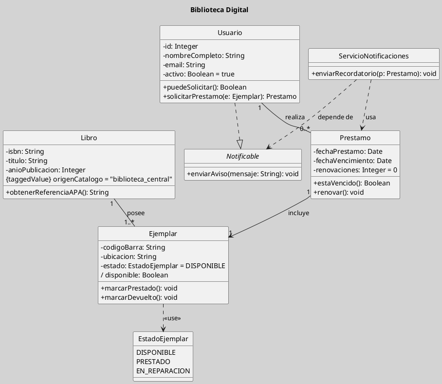

## Diagrama de Clases: Introducción, Definición, Características y sus Usos

El diagrama de clases es el instrumento central del modelado estructural en la orientación a objetos y en UML, porque permite representar la organización estática de un sistema mediante clases, atributos, operaciones y relaciones entre ellas ([[Zk Ref boochLenguajeUnificadoModelado2006|Booch et al., 2006]]; [[Zk Ref rumbaughLenguajeUnificadoModelado2007|Rumbaugh et al., 2007]]). Su valor no reside solo en “dibujar clases”, sino en hacer visible la estructura conceptual del dominio, clarificando qué entidades existen, qué información conservan, qué comportamiento ofrecen y cómo se vinculan entre sí ([[Zk Ref omgUnifiedModelingLanguage2017|OMG, 2017]]).

Desde el punto de vista del [[Zk Modelo Conceptual del UML|Modelo Conceptual del UML]], el diagrama de clases surge de la combinación de elementos y relaciones estructurales, y por ello constituye una de las expresiones más completas del enfoque orientado a objetos. En términos didácticos, suele ser el diagrama que mejor permite pasar de una comprensión informal del problema a una representación rigurosa y comunicable del sistema.

### Definición

Un diagrama de clases es una representación gráfica que muestra las clases de un sistema, sus atributos, sus operaciones y las relaciones estructurales entre ellas. Es el diagrama estructural más utilizado en UML y sirve como base para el análisis, el diseño orientado a objetos y, en muchos casos, como puente hacia la implementación y la persistencia de datos ([[Zk Ref boochLenguajeUnificadoModelado2006|Booch et al., 2006]]; [[Zk Ref omgUnifiedModelingLanguage2017|OMG, 2017]]).

Cada clase representa una abstracción relevante del dominio. No se trata de copiar literalmente la realidad, sino de seleccionar aquellas entidades, propiedades y responsabilidades que resultan significativas para el problema que se desea resolver. En este sentido, el diagrama de clases traduce el principio de [[Zk Abstracción en Orientación a Objetos|abstracción]] a una notación visual precisa.

### Qué hace Visible

El aporte principal del diagrama de clases consiste en mostrar de manera integrada cuatro dimensiones del modelo:

- Las entidades relevantes del dominio, expresadas como clases o interfaces.
- La información que cada entidad necesita conservar, representada mediante atributos.
- Los servicios o comportamientos que cada clase ofrece, representados como operaciones.
- Los vínculos estructurales entre elementos, como asociaciones, generalizaciones, dependencias, composiciones o realizaciones.

Esta capacidad de integrar estructura, semántica y relaciones convierte al diagrama de clases en una pieza clave del [[Zk Orientación a Objetos como Paradigma de Análisis y Diseño|análisis y diseño orientado a objetos]]. Antes de estudiar cómo interactúan los objetos en el tiempo, resulta necesario comprender qué objetos existen, qué saben y qué pueden hacer.

### Características Principales

| Característica | Explicación |
|---|---|
| Estructura estática | Modela la organización estable del sistema, sin describir aún su comportamiento temporal o secuencial ([[Zk Ref pressmanIngenieriaSoftwareEnfoque2013|Pressman, 2013]]). |
| Nivel de abstracción graduable | Puede usarse tanto en análisis conceptual como en diseño detallado, aumentando o reduciendo el nivel de precisión según el propósito del modelo ([[Zk Ref boochLenguajeUnificadoModelado2006|Booch et al., 2006]]). |
| Capacidad expresiva | Permite representar clases, interfaces, clases abstractas, enumeraciones, dependencias, asociaciones y otros elementos relevantes del dominio ([[Zk Ref omgUnifiedModelingLanguage2017|OMG, 2017]]). |
| Soporte para modularidad | Facilita distribuir responsabilidades y definir contratos explícitos entre partes del sistema, favoreciendo cohesión y desacoplamiento ([[Zk Ref rumbaughLenguajeUnificadoModelado2007|Rumbaugh et al., 2007]]). |
| Utilidad transversal | Puede intervenir en análisis, diseño, documentación técnica, comunicación con el equipo y derivación de otros modelos más dinámicos ([[Zk Ref sommervilleIngenieriaSoftware2011|Sommerville, 2011]]). |

Modelar con un diagrama de clases ayuda a ordenar el pensamiento antes de entrar en la lógica de eventos, mensajes o flujos de ejecución. Por ello, suele funcionar como una gramática del sistema: nombra las entidades, delimita sus responsabilidades y fija las relaciones que servirán de base para otros diagramas.

### Para qué se Usa

El diagrama de clases se utiliza en distintos momentos del desarrollo, aunque con funciones algo diferentes según el contexto:

| Uso | Explicación |
|---|---|
| Análisis | Permite identificar conceptos clave del dominio, relaciones relevantes y primeras responsabilidades de las clases. |
| Diseño | Ayuda a distribuir comportamiento, definir contratos, modularizar el sistema y anticipar decisiones de arquitectura. |
| Documentación | Sirve como artefacto de comunicación entre analistas, diseñadores, programadores, testers y otros stakeholders. |
| Base para otros diagramas | Proporciona la estructura sobre la cual se apoyan diagramas de secuencia, comunicación, componentes o estados ([[Zk Ref sommervilleIngenieriaSoftware2011|Sommerville, 2011]]). |
| Persistencia y trazabilidad | Suele orientar el diseño lógico de datos y mantener continuidad semántica entre requisitos, diseño e implementación. |

Su uso correcto no exige modelar exhaustivamente todo el sistema. En muchos contextos basta con representar las clases y relaciones más significativas para comprender o comunicar una parte concreta del dominio.

### Ejemplo Introductorio

El siguiente ejemplo muestra un sistema sencillo de préstamos de biblioteca digital. No busca agotar la notación de UML, sino ilustrar, en un único escenario, varias posibilidades expresivas del diagrama de clases: clases con atributos y operaciones, un atributo derivado, un valor por defecto, un valor etiquetado, una enumeración, una interfaz, una realización, una asociación y una dependencia.

Figura
*Ejemplo Introductorio*

*Nota*:
En este modelo, `Libro` representa la obra bibliográfica como entidad conceptual, mientras que `Ejemplar` representa cada copia concreta disponible para préstamo. Esta distinción es importante porque un mismo libro puede tener varios ejemplares físicos o lógicos, cada uno con estado propio.

La clase `Usuario` concentra información básica de identidad y la capacidad de solicitar préstamos. `Prestamo`, por su parte, actúa como una entidad transaccional que vincula un usuario con un ejemplar durante un período determinado. La asociación entre `Libro` y `Ejemplar` muestra una relación estructural estable; la relación entre `Usuario` y `Prestamo` permite leer que un usuario puede realizar múltiples préstamos.

El atributo `activo: Boolean = true` ilustra un **valor por defecto**, mientras que `/ disponible: Boolean` ejemplifica un **atributo derivado**, es decir, una propiedad que puede calcularse a partir de otras condiciones del modelo. El valor etiquetado `{taggedValue} origenCatalogo = "biblioteca_central"` se usa aquí para mostrar cómo UML puede incorporar metadatos adicionales cuando interesa enriquecer semánticamente el modelo.

La interfaz `Notificable` y su relación de realización con `Usuario` introducen la idea de contrato: no todo vínculo entre clases es una asociación o una herencia. Por su parte, `ServicioNotificaciones` mantiene relaciones de dependencia con `Prestamo` y con `Notificable`, lo que sugiere que utiliza esos elementos para prestar un servicio sin formar parte estructural permanente de ellos.

**¿Por qué este ejemplo resulta útil?**

Este ejemplo es deliberadamente moderado: tiene suficiente variedad para mostrar riqueza expresiva, pero no tanta como para oscurecer la lectura. Pedagógicamente, permite introducir varios conceptos en una sola figura sin caer todavía en jerarquías complejas, asociaciones n-arias o clases asociativas.

Además, ilustra una idea central para la enseñanza del diagrama de clases: un buen modelo no es el que contiene más símbolos, sino el que representa con claridad el núcleo estructural del problema. La finalidad del diagrama no es exhibir complejidad notacional, sino hacer inteligible el sistema.

### Relación con otros Diagramas y con el SDLC

El diagrama de clases no agota la descripción del sistema. Una vez identificadas las clases y relaciones principales, otros diagramas pueden mostrar cómo interactúan estas entidades en el tiempo, cómo cambian de estado o cómo se organizan arquitectónicamente. Por ello, este diagrama mantiene relaciones naturales con [[Zk Modelo Conceptual del UML (Diagrama de Objetos)|diagrama de objetos]], [[Zk Modelo Conceptual del UML (Diagrama de Secuencia)|diagramas de secuencia]], [[Zk Modelo Conceptual del UML (Diagrama de Comunicación)|diagramas de comunicación]], [[Zk Modelo Conceptual del UML (Diagrama de Estados)|diagramas de estados]], [[Zk Modelo Conceptual del UML (Diagrama de Componentes)|diagramas de componentes]].

En el [[Zk Ciclo de Vida del Desarrollo del Software (SDLC)|ciclo de vida del desarrollo del software]], suele aparecer desde etapas tempranas de análisis y continuar refinándose durante el diseño. Esta continuidad lo convierte en un artefacto especialmente valioso para mantener coherencia entre requisitos, diseño e implementación.

### Idea Final

El diagrama de clases es mucho más que un inventario de clases: es una representación estructural del conocimiento que el sistema necesita manejar. Su verdadero valor aparece cuando ayuda a pensar mejor el dominio, a distribuir responsabilidades con criterio y a construir una base conceptual sólida para el resto del modelado.

### Enlaces Sugeridos

- [[Zk Modelo Conceptual del UML|Modelo Conceptual del UML]]
- [[Zk Diagrama de Clases (Elementos, Clases)|Clases]]
- [[Zk Diagrama de Clases (Elemento, Clase - Atributos)|Atributos]]
- [[Zk Diagrama de Clases (Elemento, Clase -  Operaciones, Métodos)|Operaciones]]
- [[Zk Diagrama de Clases (Elementos, Interfaces)|Interfaces]]
- [[Zk Diagrama de Clases (Relaciones)|Relaciones]]
- [[Zk Diagrama de Clases (Relaciones, Asociación)|Asociación]]
- [[Zk Diagrama de Clases (Relaciones, Dependencia)|Dependencia]]
- [[Zk Diagrama de Clases (Relaciones, Realización)|Realización]]
- [[Zk Diagrama de Clases (Clases Abstractas)|Clases Abstractas]]
- [[Zk Orientación a Objetos como Paradigma de Análisis y Diseño|Orientación a Objetos]]
- [[Zk Atributos, Operaciones y Mensajes|Atributos, Operaciones y Mensajes]]

