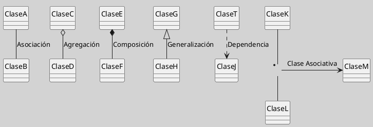
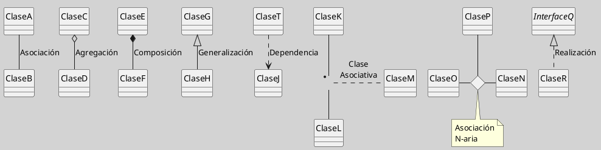

## Diagrama de Clases (Relaciones)

Las relaciones en UML definen cómo las clases interactúan y se vinculan estructural o comportamentalmente. Son esenciales para modelar la arquitectura estática de un sistema ([[Zk Ref omgUnifiedModelingLanguage2017|OMG, 2017]]; [[Zk Ref rumbaughLenguajeUnificadoModelado2007|Rumbaugh et al., 2007]]).

### Tipos de Relaciones Principales

| Relación                                                                             | Símbolo                          | Descripción                                           |
| ------------------------------------------------------------------------------------ | -------------------------------- | ----------------------------------------------------- |
| [[Zk Diagrama de Clases (Relaciones, Asociación)\|Asociación]]                       | Línea continua                   | Conexión estructural entre clases independientes      |
| [[Zk Diagrama de Clases (Relaciones, Agregación)\|Agregación]]                       | Rombo vacío                      | Relación "todo-parte" no exclusiva                    |
| [[Zk Diagrama de Clases (Relaciones, Composición)\|Composición]]                     | Rombo relleno                    | Relación "todo-parte" con dependencia vital           |
| [[Zk Diagrama de Clases (Relaciones, Generalización)\|Generalización]]               | Flecha hueca                     | Herencia entre clases (relación padre-hijo)           |
| [[Zk Diagrama de Clases (Relaciones, Dependencia)\|Dependencia]]                     | Línea punteada                   | Uso temporal o débil entre clases                     |
| [[Zk Diagrama de Clases (Relaciones, Clases Asociativas)\|Clase Asociativa]]         | Rectángulo vinculado             | Clase que gestiona atributos de una asociación        |
| [[Zk Diagrama de Clases (Relaciones, Asociaciones N-arias)\|Asociación N-Aria]]      | Rombo sin relleno (nodo central) | Asociación simultánea entre tres o más clases         |
| [[Zk Modelo Conceptual del UML (Relaciones Estructurales) Realización\|Realización]] | Línea discontinua + flecha hueca | Compromiso de implementar el contrato de una interfaz |

**Figura**
_Ejemplos de Relaciones_

*Nota*: síntesis visual de los principales tipos de relaciones estructurales en el diagrama de clases UML.

### Características Comunes

- **Multiplicidad**: Define cuántas instancias participan en la relación (ejemplo: `1`, `0..*`, `1..5`) [[Zk Ref rumbaughLenguajeUnificadoModelado2007|(Rumbaugh et al., 2007)]].
- **Navegabilidad**: Indica la dirección accesible de la relación (flecha opcional).
- **Roles**: Nombres que describen la función de cada extremo (ejemplo: `empleado: Empleado`).

### Enlaces Sugeridos

- [[Zk Diagrama de Clases (Agregación vs. Composición)|Agregación vs. Composición]]
- [[Zk Modelo Conceptual del UML (Relaciones Estructurales)|Relaciones Estructurales en el Metamodelo UML]]
