## Diagrama de Clases (Relaciones, Agregación)

La agregación es una forma especial de asociación en UML que representa una relación "todo-parte" entre clases, donde la parte puede existir independientemente del todo. Es útil para modelar estructuras jerárquicas y colecciones de objetos, manteniendo una semántica de débil acoplamiento entre los participantes ([[Zk Ref omgUnifiedModelingLanguage2017|OMG, 2017]]; [[Zk Ref rumbaughLenguajeUnificadoModelado2007|Rumbaugh et al., 2007]]).

### Definición

La **asociación por agregación** indica que una clase (el "todo" o agregador) está compuesta por una o varias instancias de otra clase (la "parte"), pero la existencia de las partes no depende de la existencia del todo. Si el todo se destruye, las partes pueden seguir existiendo independientemente ([[Zk Ref omgUnifiedModelingLanguage2017|OMG, 2017]]).

### Notación y Sintaxis

- Se representa como una **línea continua** con un **rombo blanco** en el extremo del "todo".
- El rombo apunta hacia la clase agregadora.
- Se pueden especificar multiplicidades y roles en ambos extremos.
    
**Figura**
_Ejemplo de una Relación de Asociación por Agregación_

```plantuml-code
@startuml 
!pragma layout smetana
skinparam style strictuml
skinparam classAttributeIconSize 0
skinparam BackgroundColor LightGray
'left to right direction
top to bottom direction
skinparam linetype ortho
scale 1

class Departamento
class Empleado

Departamento o-- "0..*" Empleado : contiene
@enduml
```

_Nota_: Un `Departamento` puede contener varios `Empleado`, pero los empleados pueden existir aunque el departamento sea eliminado.

### Ejemplo con Roles y Multiplicidad

**Figura**
_Ejemplo de una Relación de Asociación por Agregación de un Equipo de Fútbol_

```plantuml-code
@startuml 
!pragma layout smetana
skinparam style strictuml
skinparam classAttributeIconSize 0
skinparam BackgroundColor LightGray
'left to right direction
top to bottom direction
skinparam linetype ortho
scale 1

class Equipo
class Jugador

Equipo o-- "7..11" Jugador : alineación
@enduml
```

_Nota_: Un `Equipo` tiene entre 7 y 11 `Jugador`, pero un jugador puede existir fuera de un equipo. Un equipo de fútbol debe arrancar con 11 jugadores, y el mínimo con el que puede quedar durante el partido es 7.

### Características Clave

- **Relación débil "todo-parte"**: el ciclo de vida de las partes es independiente del todo.
    
- **Multiplicidad**: se usa para indicar cuántas partes puede tener el todo (ejemplo: `0..*`).
    
- **Navegabilidad**: puede ser bidireccional o unidireccional, según el dominio.
    
- **Semántica**: la agregación es principalmente conceptual y no implica necesariamente una implementación física de contención ([[Zk Ref boochLenguajeUnificadoModelado2006|Booch et al., 2006]]).

### Buenas Prácticas

- Preferir la agregación cuando las partes tienen identidad propia y pueden participar en múltiples agregados o existir fuera de ellos.
- No confundir con composición: si la parte carece de significado fuera del todo, la semántica correcta es la composición.
- Nombrar el rol del extremo "parte" cuando su función en el dominio no sea evidente.

### Comparación con Composición

![[Zk Diagrama de Clases (Agregación vs. Composición)#Diferencias Fundamentales]]

### Enlaces Sugeridos

- [[Zk Diagrama de Clases (Relaciones)|Relaciones: Visión General]]
- [[Zk Diagrama de Clases (Relaciones, Composición)|Composición]]
- [[Zk Diagrama de Clases (Relaciones, Asociación)|Asociación]]