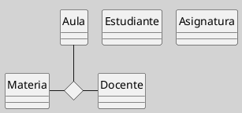
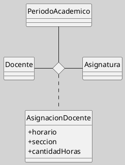

## Asociaciones N-arias en el Diagrama de Clases

Las asociaciones n-arias son relaciones estructurales que vinculan simultáneamente a tres o más clasificadores dentro de una única unidad semántica. A diferencia de la asociación binaria, que conecta dos clases, la asociación n-aria expresa que el significado de la relación depende de la concurrencia de varios participantes y no puede reducirse sin pérdida conceptual a un conjunto de vínculos tomados por separado ([[Zk Ref omgUnifiedModelingLanguage2017|OMG, 2017]]; [[Zk Ref boochLenguajeUnificadoModelado2006|Booch et al., 2006]]).

### Definición y Núcleo Semántico

Una asociación n-aria debe utilizarse cuando un hecho del dominio solo adquiere sentido completo al considerar conjuntamente tres o más clases. Su rasgo distintivo no es la cantidad de líneas del dibujo, sino la indivisibilidad semántica del vínculo: cada instancia de la asociación involucra una combinación coordinada de participantes.

Por ejemplo, en un contexto académico, la relación entre `Profesor`, `Materia` y `Aula` puede requerir una asociación ternaria si lo que se quiere representar no es simplemente que un profesor dicta una materia o que una materia se desarrolla en un aula, sino que una asignación concreta de docencia ocurre para esa materia, con ese profesor y en esa aula, como un único hecho del dominio.

### Notación en UML

En UML, una asociación n-aria se representa mediante un rombo central conectado por líneas a cada una de las clases participantes. Cada extremo puede llevar su nombre de rol y su multiplicidad, del mismo modo que en una asociación binaria, aunque su interpretación exige atender al conjunto de los demás extremos.

La lectura de la multiplicidad en una asociación n-aria no es trivial. Mientras que en una asociación binaria cada multiplicidad se interpreta respecto del extremo opuesto, en una n-aria debe entenderse en relación con una combinación fija de los demás participantes. Esta diferencia hace que su uso exija mayor precisión conceptual y didáctica.

Tomando el ejemplo indicado más arriba:

**Título**
*Notación de una Asociación Ternaria*

### Cuándo Conviene Utilizarla

Las asociaciones n-arias son pertinentes cuando se modelan hechos compuestos tales como asignaciones, reservas, programaciones, participaciones o registros cuya identidad depende de varios elementos simultáneos. Son especialmente útiles en dominios administrativos, académicos, logísticos o de planificación, donde muchas relaciones no son meramente duales.

Sin embargo, conviene no abusar de ellas. En modelos pedagógicos o en diseños orientados a implementación, una asociación n-aria puede dificultar la lectura si el dominio no exige verdaderamente esa forma. En esos casos, a menudo resulta preferible transformarla en una clase asociativa o en una entidad explícita que haga visible el hecho compuesto con mayor claridad.

### Diferencia con Asociaciones Binarias

No toda situación con tres clases exige una asociación ternaria. En muchos casos, el dominio puede modelarse adecuadamente mediante varias asociaciones binarias independientes. La clave está en determinar si esas asociaciones conservan por sí mismas el significado original o si, por el contrario, fragmentan artificialmente una relación que solo es inteligible como totalidad.

Si al descomponer una relación en asociaciones binarias se pierde la restricción contextual entre los participantes, entonces la asociación n-aria está justificada. Dicho de otro modo: si el modelo binario permite combinaciones que el dominio real no admite, la representación resulta conceptualmente deficiente.

### Ejemplo Conceptual

Considérese un sistema universitario donde se desea modelar la asignación de clases. Una relación entre `Docente`, `Asignatura` y `PeriodoAcadémico` puede requerir una asociación ternaria si cada asignación solo existe como combinación de esos tres elementos. No basta con afirmar que un docente enseña una asignatura y que una asignatura pertenece a un periodo; lo relevante es la asignación concreta de ese docente a esa asignatura en ese periodo específico.

Si además esa asignación necesita atributos como `horario`, `sección` o `cantidadDeHoras`, entonces el modelo probablemente se beneficia al convertir esa relación en una clase explícita, por ejemplo `AsignaciónDocente`.

Figura
_Implementación del Ejemplo_

### Criterio Didáctico y de Modelado

Desde el punto de vista didáctico, las asociaciones n-arias son valiosas porque obligan a distinguir entre proximidad gráfica y precisión semántica. Enseñan que modelar no consiste en unir clases por intuición, sino en identificar con rigor qué hecho del dominio se quiere representar y bajo qué condiciones ese hecho conserva su sentido.

Desde el punto de vista metodológico, conviene introducirlas después de que el estudiante domine las asociaciones binarias, la multiplicidad y la clase asociativa. De lo contrario, existe el riesgo de que se perciban como una mera variante gráfica, cuando en realidad implican una decisión semántica más exigente.

### Comparación con Clase Asociativa

![[Zk Diagrama de Clases (Clase Asociativa vs Asociación N-Aria)#Distinción Conceptual]]

### Idea Final

La asociación n-aria no añade complejidad por capricho gráfico; aparece cuando el dominio contiene hechos relacionales que solo pueden comprenderse correctamente como configuraciones simultáneas de varios participantes. Su valor reside, por tanto, en preservar la semántica del fenómeno modelado allí donde las asociaciones binarias resultan insuficientes.

### Enlaces Recomendados

- [[Zk UML - Multiplicidad|Multiplicidad]]
- [[Zk Diagrama de Clases (Relaciones)|Relaciones]]
- [[Zk Diagrama de Clases (Relaciones, Asociación)|Asociación]]
- [[Zk Diagrama de Clases (Relaciones, Clases Asociativas)|Clases Asociativas]]
- [[Zk Diagrama de Clases (Elementos, Clases Persistentes)|Clases Persistentes]]
- [[Zk Modelo Conceptual del UML (Diagrama de Clases)|Modelo Conceptual del UML Diagrama de Clases]]
