## Diagrama de Clases (Relaciones, Asociación)

La **asociación** es la relación estructural más fundamental en UML para conectar, en particular entre clases. Permite modelar cómo las instancias de dos o más clases pueden estar relacionadas y colaborar dentro del sistema ([[Zk Ref omgUnifiedModelingLanguage2017|OMG, 2017]]; [[Zk Ref rumbaughLenguajeUnificadoModelado2007|Rumbaugh et al., 2007]]).

### Definición

Una **asociación** representa una conexión semántica entre clases, indicando que existe una relación significativa entre sus instancias. Es bidireccional por defecto, pero puede ser unidireccional si se especifica la navegabilidad ([[Zk Ref omgUnifiedModelingLanguage2017|OMG, 2017]]; [[Zk Ref boochLenguajeUnificadoModelado2006|Booch et al., 2006]]).

### Notación y Sintaxis

- **Línea continua** entre las clases ([[Zk Ref omgUnifiedModelingLanguage2017|OMG, 2017]]). 
- Puede incluir: 
	- **Nombre de la asociación** (opcional, sobre la línea) 
	- **Roles**: nombres en los extremos que describen el papel de cada clase en la relación 
	- **Multiplicidad**: cuántas instancias de una clase pueden estar asociadas a una instancia de la otra (`1`, `0..*`, etc.) 
	- **Navegabilidad**: flecha en el extremo indica dirección de acceso

**Figura**
_Ejemplo de una Relación de Asociación_

_Nota_: Una `Persona` puede ser titular de varias `CuentaBancaria`, y cada cuenta tiene un titular.

### Características

- **Bidireccionalidad**: Por defecto, ambas clases pueden accederse mutuamente ([[Zk Ref boochLenguajeUnificadoModelado2006|Booch et al., 2006]]). 
- **Unidireccionalidad**: Se indica con una flecha en el extremo navegable ([[Zk Ref omgUnifiedModelingLanguage2017|OMG, 2017]]).
- **Navegabilidad**: Especifica si una clase puede acceder a la otra a través de la asociación ([[Zk Ref omgUnifiedModelingLanguage2017|OMG, 2017]]). 
- **Multiplicidad**: Define restricciones de cantidad en cada extremo (`1`, `0..1`, `*`) ([[Zk Ref rumbaughLenguajeUnificadoModelado2007|Rumbaugh et al., 2007]]). 
- **Rol**: Nombre opcional que clarifica el propósito de cada extremo ([[Zk Ref rumbaughLenguajeUnificadoModelado2007|Rumbaugh et al., 2007]]).

### Ejemplo con Roles y Multiplicidad

**Figura**
_Ejemplo con Roles y Multiplicidad_

```plantuml-code
@startuml 
!pragma layout smetana
skinparam style strictuml
skinparam classAttributeIconSize 0
skinparam BackgroundColor LightGray
'left to right direction
top to bottom direction
skinparam linetype ortho
scale 1

class Profesor
class Curso

Profesor "1" --- "1..*" Curso : Imparte
Curso "1" -- "0..*" Profesor : Dictado Por
@enduml
```

_Nota_: Un `Profesor` imparte uno o varios `Curso`; cada `Curso` puede ser dictado por uno o varios profesores.

### Buenas Prácticas

- Nombrar los roles cuando la función de cada extremo no es obvia ([[Zk Ref rumbaughLenguajeUnificadoModelado2007|Rumbaugh et al., 2007]]). 
- Especificar multiplicidad siempre que sea relevante para el dominio ([[Zk Ref omgUnifiedModelingLanguage2017|OMG, 2017]]). 
- Usar navegabilidad para indicar dependencias de acceso ([[Zk Ref boochLenguajeUnificadoModelado2006|Booch et al., 2006]]).

### Idea Final

La asociación no expresa solo que dos clases se conocen entre sí: expresa que sus instancias tienen una relación semántica significativa dentro del dominio. Antes de elegir una forma más específica —agregación, composición, dependencia— conviene verificar si una asociación simple con multiplicidad y roles bien definidos ya comunica todo lo necesario ([[Zk Ref boochLenguajeUnificadoModelado2006|Booch et al., 2006]]; [[Zk Ref rumbaughLenguajeUnificadoModelado2007|Rumbaugh et al., 2007]]). 

### Enlaces Sugeridos

- [[Zk Diagrama de Clases (Relaciones)|Relaciones en el Diagrama de Clases]] 
- [[Zk Diagrama de Clases (Relaciones, Composición)|Composición]] 
- [[Zk Diagrama de Clases (Relaciones, Agregación)|Agregación]] 
- [[Zk Diagrama de Clases (Relaciones, Dependencia)|Dependencia]] 
- [[Zk UML - Multiplicidad|Multiplicidad en UML]] 
- [[Zk !MOC Diagrama de Clases (Fundamentos, Elementos, Relaciones, etc.)|Diagrama de Clases (Fundamentos, Elementos, Relaciones, etc.)]] 