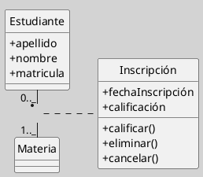
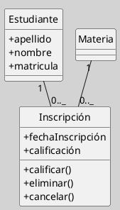

## Diagrama de Clases (Relaciones, Clases Asociativas)

La clase asociativa es un elemento estructural del diagrama de clases de UML que permite modelar asociaciones que requieren atributos, operaciones o comportamientos propios, más allá de los que pueden representarse mediante una simple relación entre dos o más clases. Es fundamental para capturar información relevante de la relación misma y no de las clases participantes ([[Zk Ref boochLenguajeUnificadoModelado2006|Booch et al., 2006]]; [[Zk Ref omgUnifiedModelingLanguage2017|OMG, 2017]]; [[Zk Ref rumbaughLenguajeUnificadoModelado2007|Rumbaugh et al., 2007]]).

### Definición

Una **clase asociativa** es una clase que se asocia a una relación entre dos o más clases y que permite modelar atributos y operaciones propios del vínculo, no de las clases individuales. Es la solución adecuada cuando la asociación entre clases posee información que debe ser gestionada de manera explícita y que no pertenece naturalmente a ninguno de los participantes ([[Zk Ref omgUnifiedModelingLanguage2017|OMG, 2017]]).

### Notación y Sintaxis

**Representación gráfica:**
- Se dibuja la asociación entre las clases participantes.
- Sobre la línea de la asociación se coloca un rectángulo (la clase asociativa) conectado a la línea con una línea discontinua (UML estándar).
- La clase asociativa puede contener atributos y operaciones, igual que cualquier clase.

**Figura**
_Ejemplo de la Relación de Clase Asociativa_

_Nota_: En una relación entre `Estudiante` y `Materia`, la inscripción (`Inscripción`) puede requerir atributos como la fecha de inscripción o la calificación obtenida, que no pertenecen ni a `Estudiante` ni a `Materia`, sino a la relación entre ambos. También puede representarse como clases relacionadas entre sí, manteniendo la misma semántica.

#### Representación Alternativa: Descomposición en tres Clases

Cuando la clase asociativa necesita participar en otras relaciones o el ORM[^1] la trata como entidad independiente, es preferible descomponerla en tres clases ordinarias relacionadas entre sí. Ambas representaciones son semánticamente equivalentes para el caso básico ([[Zk Ref rumbaughLenguajeUnificadoModelado2007|Rumbaugh et al., 2007]]).

**Figura**
_Ejemplo de Otra Forma de Representar con una Sintaxis Distinta pero con la misma semántica_

*Nota*: en esta forma, `Inscripción` es una clase ordinaria relacionada con `Estudiante` y `Materia`. Es preferible cuando `Inscripción` participa en otras relaciones del modelo o debe ser gestionada como entidad persistente independiente.

### Criterio de Elección entre Ambas Representaciones

| Situación                                                            | Representación recomendada    |
| -------------------------------------------------------------------- | ----------------------------- |
| La relación tiene pocos atributos y no participa en otras relaciones | Clase asociativa canónica     |
| La clase asociativa necesita relacionarse con otras clases           | Descomposición en tres clases |
| El ORM trata la clase como entidad independiente                     | Descomposición en tres clases |
| Se prioriza la fidelidad semántica al dominio                        | Clase asociativa canónica     |
### Buenas Prácticas

- Verificar que los atributos modelados pertenecen genuinamente al vínculo y no a alguna de las clases participantes antes de introducir una clase asociativa.
    
- Nombrar la clase asociativa con un sustantivo que describa el vínculo en el dominio (`Inscripción`, `Contrato`, `Asignación`), no con nombres derivados de las clases participantes.
    
- Considerar la descomposición en tres clases desde el inicio si se anticipa que la clase asociativa crecerá en responsabilidades.

### Comparación con Asociación N-Aria

![[Zk Diagrama de Clases (Clase Asociativa vs Asociación N-Aria)#Distinción Conceptual]]

### Enlaces Sugeridos

- [[Zk Diagrama de Clases (Relaciones)|Relaciones: Visión General]]
- [[Zk Diagrama de Clases (Relaciones, Asociación)|Asociación]]
- [[Zk Diagrama de Clases (Relaciones, Asociaciones N-arias)|Asociaciones N-arias]]

---
[^1]: Object-Relational Mapping o Mapeo Objeto-Relacional 