## Diagrama de Clases (Relaciones, Composición)

La **composición** es una forma estricta de agregación que representa una relación "todo-parte" con dependencia vital. Las partes no pueden existir independientemente del todo y son destruidas cuando éste se elimina ([[Zk Ref omgUnifiedModelingLanguage2017|OMG, 2017]]; [[Zk Ref rumbaughLenguajeUnificadoModelado2007|Rumbaugh et al., 2007]]).

### Definición

La **composición** indica una relación "parte-de" más fuerte entre clases. Una clase (el "todo" o _composite_) **contiene** una o varias instancias de otra clase (la "parte"), y la **existencia de las partes depende completamente de la existencia del todo**. Si el todo se destruye, las partes también se destruyen simultáneamente ([[Zk Ref omgUnifiedModelingLanguage2017|OMG, 2017]]). En otras palabras:

- El **todo** posee exclusivamente las **partes**.
- Las partes tienen el mismo ciclo de vida que el todo.
- La destrucción del todo implica la destrucción de todas sus partes.
    
### Notación y Sintaxis

- Se representa como una **línea continua** con un **rombo relleno** en el extremo del "todo".
- El rombo apunta hacia la clase _composite_.
- Se pueden especificar multiplicidades y roles en ambos extremos.
    
**Figura**  
_Ejemplo de una Relación de Composición_

```plantuml-code
@startuml 
!pragma layout smetana
skinparam style strictuml
skinparam classAttributeIconSize 0
skinparam BackgroundColor LightGray
'left to right direction
top to bottom direction
skinparam linetype ortho
scale 1

class Avion {  
  -ala: Ala [2]
}  
class Ala  

Avion *-- Ala
@enduml  
```

_Nota_: Cada `Avion` tiene exactamente dos `Ala` y son exclusivas del mismo.

_destruye, el `Motor` también._

### Características Clave

- **Dependencia vital**: las partes no tienen significado fuera del contexto del todo (ejemplo: un `Motor` sin el `Auto` que lo contiene).
    
- **Multiplicidad**: el todo suele tener multiplicidad `1` del lado de las partes, indicando propiedad exclusiva.
    
- **Encapsulación fuerte**: las partes son accesibles únicamente a través del todo ([[Zk Ref boochLenguajeUnificadoModelado2006|Booch et al., 2006]]).
    

### Buenas Prácticas

- Usar composición cuando las partes carecen de identidad significativa fuera del contexto del todo: párrafos en un documento, habitaciones en un edificio, líneas en un pedido.
    
- No usar composición cuando la parte pueda pertenecer a más de un todo simultáneamente o sobrevivir a su eliminación; en ese caso, la semántica correcta es la agregación.
    
- Verificar que la multiplicidad del lado del todo sea efectivamente `1` antes de modelar como composición; si puede ser `0`, conviene reconsiderar.
    
### Comparación con Agregación

![[Zk Diagrama de Clases (Agregación vs. Composición)#Diferencias Fundamentales]]

### Enlaces Sugeridos

- [[Zk Diagrama de Clases (Relaciones)|Relaciones: Visión General]]
- [[Zk Diagrama de Clases (Relaciones, Agregación)|Agregación]]
- [[Zk Diagrama de Clases (Relaciones, Asociación)|Asociación]]