## Diagrama de Clases (Relaciones, Dependencia)

La **dependencia** es una relación estructural débil en UML que indica que un elemento (por ejemplo, una clase) utiliza, referencia o depende de la definición de otro elemento para su funcionamiento, pero no forma parte de su estructura interna. Es fundamental para modelar acoplamientos temporales, uso de servicios, parámetros, tipos o relaciones de implementación ([[Zk Ref omgUnifiedModelingLanguage2017|OMG, 2017]]; [[Zk Ref rumbaughLenguajeUnificadoModelado2007|Rumbaugh et al., 2007]]).

### Definición

La **dependencia** expresa que un cambio en el elemento del que se depende puede afectar al elemento dependiente, pero no implica una relación estructural permanente ([[Zk Ref omgUnifiedModelingLanguage2017|OMG, 2017]]). Es común en situaciones donde una clase usa otra como parámetro, variable local, tipo de retorno, o invoca sus operaciones de manera temporal ([[Zk Ref rumbaughLenguajeUnificadoModelado2007|Rumbaugh et al., 2007]]).

### Notación y Sintaxis

- Se representa como una **línea punteada** con una **flecha abierta** apuntando desde el elemento dependiente hacia el elemento del que depende ([[Zk Ref omgUnifiedModelingLanguage2017|OMG, 2017]]).
- Opcionalmente, se puede etiquetar con un estereotipo como `«use»`, `«call»`, `«instantiate»`, etc.

**Figura**
_Ejemplo de una Relación de Dependencia_

```plantuml-code
@startuml 
!pragma layout smetana
skinparam style strictuml
skinparam classAttributeIconSize 0
skinparam BackgroundColor LightGray
'left to right direction
top to bottom direction
skinparam linetype ortho
scale 1

class Cliente
class Servicio

Cliente ..> Servicio : usa
@enduml
```

_Nota_: `Cliente` depende de `Servicio` porque lo utiliza, pero no lo contiene ni lo asocia permanentemente.

### Características

- **Relación débil**: No implica propiedad ni vida compartida ([[Zk Ref boochLenguajeUnificadoModelado2006|Booch et al., 2006]]). 
- **Temporalidad**: Usualmente ocurre durante la ejecución de una operación o método ([[Zk Ref rumbaughLenguajeUnificadoModelado2007|Rumbaugh et al., 2007]]). 
- **Acoplamiento bajo**: Facilita el diseño modular y la evolución independiente de componentes ([[Zk Ref boochLenguajeUnificadoModelado2006|Booch et al., 2006]]). 
- **Uso frecuente**: Para modelar parámetros, tipos de retorno, llamadas a métodos, uso de librerías, etc. ([[Zk Ref omgUnifiedModelingLanguage2017|OMG, 2017]]).

### Ejemplos Comunes

- Una clase que recibe otra como argumento en un método ([[Zk Ref rumbaughLenguajeUnificadoModelado2007|Rumbaugh et al., 2007]]). 
- Una clase que crea instancias de otra temporalmente ([[Zk Ref rumbaughLenguajeUnificadoModelado2007|Rumbaugh et al., 2007]]). 
- Una clase que invoca métodos estáticos de otra ([[Zk Ref boochLenguajeUnificadoModelado2006|Booch et al., 2006]]).

**Figura**
_Relación de Dependencia con Estereotipo `<<use>>`_

```plantuml-code
@startuml 
!pragma layout smetana
skinparam style strictuml
skinparam classAttributeIconSize 0
skinparam BackgroundColor LightGray
'left to right direction
top to bottom direction
skinparam linetype ortho
scale 1

class Pedido
class Logger

Pedido ..> Logger : <<use>>
@enduml
```

_Nota_: `Pedido` depende de `Logger` para registrar información, pero no almacena una referencia permanente.

### Buenas Prácticas

- Utilizar dependencias para reducir acoplamiento entre módulos ([[Zk Ref boochLenguajeUnificadoModelado2006|Booch et al., 2006]]). 
- Documentar el motivo de la dependencia con un estereotipo si no es evidente por el contexto ([[Zk Ref omgUnifiedModelingLanguage2017|OMG, 2017]]). 
- Evitar dependencias innecesarias para mantener la flexibilidad del diseño ([[Zk Ref rumbaughLenguajeUnificadoModelado2007|Rumbaugh et al., 2007]]). 

### Idea Final

La dependencia señala el acoplamiento más débil del diagrama de clases: no hay propiedad, no hay estructura compartida, solo un uso temporal. Precisamente por esa debilidad, es la relación más difícil de detectar visualmente en el código y la más valiosa para documentar explícitamente cuando el modelo necesita exponer qué elementos dependen de qué servicios o tipos externos ([[Zk Ref boochLenguajeUnificadoModelado2006|Booch et al., 2006]]; [[Zk Ref omgUnifiedModelingLanguage2017|OMG, 2017]]).

### Enlaces Sugeridos

- [[Zk Diagrama de Clases (Relaciones)|Relaciones en el Diagrama de Clases]] 
- [[Zk Diagrama de Clases (Relaciones, Asociación)|Asociación]] 
- [[Zk Diagrama de Clases (Relaciones, Composición)|Composición]] 
- [[Zk Diagrama de Clases (Relaciones, Generalización)|Generalización]] 
- [[Zk !MOC Diagrama de Clases (Fundamentos, Elementos, Relaciones, etc.)|Diagrama de Clases: Fundamentos, Elementos y Relaciones]]
