## Diagrama de Clases (Relaciones, Generalización)

La **generalización** es una relación jerárquica fundamental en UML, que representa herencia entre clases, permitiendo compartir atributos y operaciones comunes, y facilitando la reutilización y extensión del modelo ([[Zk Ref omgUnifiedModelingLanguage2017|OMG, 2017]]; [[Zk Ref rumbaughLenguajeUnificadoModelado2007|Rumbaugh et al., 2007]]).

### Definición

La **generalización** establece una relación entre una clase más general (superclase o padre) y una o más clases más específicas (subclases o hijas). Las subclases heredan los atributos, operaciones y relaciones de la superclase, pudiendo además extenderlos o especializarlos ([[Zk Ref rumbaughLenguajeUnificadoModelado2007|Rumbaugh et al., 2007]]).

### Notación y Sintaxis

- Se representa como una **línea continua** con una **flecha hueca** que apunta desde la subclase hacia la superclase.
- Puede involucrar una o varias subclases (herencia simple o múltiple).

**Figura**
_Ejemplo de dos Relaciones de Generalización_

```plantuml-code
@startuml 
!pragma layout smetana
skinparam style strictuml
skinparam classAttributeIconSize 0
skinparam BackgroundColor LightGray
'left to right direction
top to bottom direction
skinparam linetype ortho
scale 1

class Figura {
  +dibujar(): void
}
class Circulo
class Rectangulo

Circulo --|> Figura
Rectangulo --|> Figura
@enduml
```

_Nota_: En este ejemplo, `Circulo` y `Rectangulo` heredan de `Figura`, por lo que comparten la operación `dibujar()`.

### Características

- **Herencia**: Las subclases reciben automáticamente los atributos y operaciones de la superclase ([[Zk Ref boochLenguajeUnificadoModelado2006|Booch et al., 2006]]).
- **Polimorfismo**: Las subclases pueden redefinir (sobrescribir) operaciones de la superclase ([[Zk Ref boochLenguajeUnificadoModelado2006|Booch et al., 2006]]).
- **Especialización**: Las subclases pueden añadir nuevos atributos y operaciones propios ([[Zk Ref rumbaughLenguajeUnificadoModelado2007|Rumbaugh et al., 2007]]).
- **Abstractización**: La superclase puede ser abstracta (no instanciable) si define operaciones sin implementación ([[Zk Ref omgUnifiedModelingLanguage2017|OMG, 2017]]).

### Buenas Prácticas

- Utilizar generalización para evitar duplicidad de código y centralizar comportamientos comunes ([[Zk Ref boochLenguajeUnificadoModelado2006|Booch et al., 2006]]).
- No abusar de la herencia; preferir composición cuando la relación no sea de tipo "es-un" ([[Zk Ref rumbaughLenguajeUnificadoModelado2007|Rumbaugh et al., 2007]]).
- Documentar claramente las diferencias y responsabilidades de cada subclase ([[Zk Ref omgUnifiedModelingLanguage2017|OMG, 2017]]).

### Idea Final

La generalización no es simplemente un mecanismo técnico de herencia: es una decisión conceptual que afirma que varias clases concretas son variantes de un mismo concepto más general. Su valor en el modelo reside en hacer explícita esa relación, concentrar la estructura común y habilitar el polimorfismo como mecanismo de extensión ([[Zk Ref boochLenguajeUnificadoModelado2006|Booch et al., 2006]]; [[Zk Ref rumbaughLenguajeUnificadoModelado2007|Rumbaugh et al., 2007]]).

### Enlaces Sugeridos

- [[Zk Diagrama de Clases (Clases Abstractas)|Clases Abstractas]]
- [[Zk Diagrama de Clases (Clase Abstracta vs. Interfaz)|Clase Abstracta vs. Interfaz]]
- [[Zk Diagrama de Clases (Relaciones, Realización)|Realización]]
