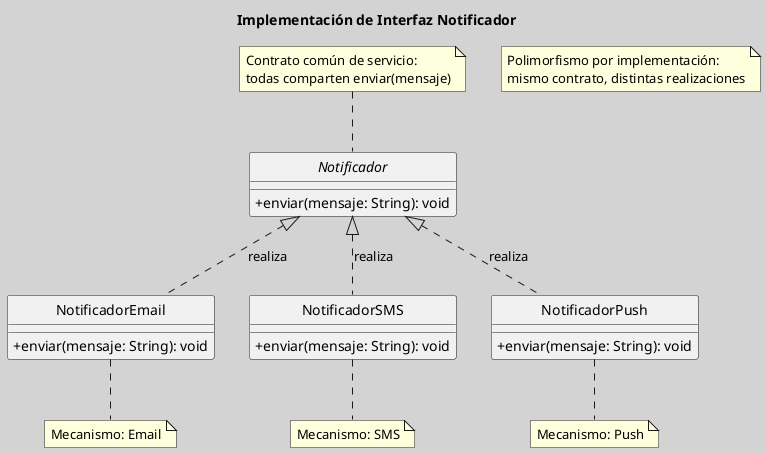

## Realización de Interfaces en el Diagrama de Clases

La realización es una relación estructural mediante la cual una clase o componente se compromete a cumplir el contrato definido por una interfaz. En el diagrama de clases, esta relación expresa que el elemento concreto provee una implementación para las operaciones declaradas de forma abstracta, sin heredar estado ni estructura de una superclase ([[Zk Ref omgUnifiedModelingLanguage2017|OMG, 2017]]; [[Zk Ref boochLenguajeUnificadoModelado2006|Booch et al., 2006]]).

### Definición y Sentido Conceptual

A diferencia de la generalización, que establece una relación de herencia entre una clase más general y una más específica, la realización conecta una especificación abstracta con una implementación concreta. Su núcleo semántico no es la especialización taxonómica, sino el cumplimiento de un contrato: la clase realizadora promete ofrecer los servicios definidos por la interfaz en los términos establecidos por ella ([[Zk Ref rumbaughLenguajeUnificadoModelado2007|Rumbaugh et al., 2007]]).

En términos de diseño, esto permite separar con claridad la definición de capacidades de su materialización concreta. Así, el modelo gana flexibilidad, favorece el desacoplamiento y hace posible sustituir implementaciones sin alterar a los clientes que dependen de la interfaz.

### Notación en UML

La realización se representa mediante una línea discontinua con un triángulo vacío apuntando hacia la interfaz. El sentido de la flecha indica que la clase concreta depende del contrato abstracto y no al revés.

En la práctica, la interfaz suele nombrarse con un sustantivo o una capacidad relevante del dominio, mientras que la clase concreta adopta el papel de implementadora. Esta convención refuerza la distinción entre el qué se ofrece y el cómo se realiza.

![[Zk Modelo Conceptual del UML (Relaciones Estructurales) Realización#Visualización]]

### Diferencia con Generalización

La confusión entre realización y generalización es frecuente en etapas iniciales del aprendizaje de UML, pero ambas relaciones responden a lógicas distintas. La generalización expresa una relación de tipo “es-un”; la realización expresa una relación de tipo “cumple-con” o “implementa”.

Una subclase hereda atributos, operaciones y, eventualmente, comportamiento de su superclase. En cambio, una clase que realiza una interfaz no hereda estado; solo asume la obligación de implementar las operaciones declaradas por el contrato abstracto. Esta diferencia es decisiva tanto en el análisis conceptual como en el diseño orientado a objetos.

### Cuándo Usarla

La realización resulta pertinente cuando se desea modelar un conjunto de servicios estables que pueden ser ofrecidos por implementaciones diferentes. Esto ocurre, por ejemplo, en arquitecturas por capas, patrones de diseño, puertos de integración, repositorios, servicios de dominio o mecanismos de persistencia.

También es especialmente útil cuando interesa preservar independencia entre clientes y proveedores concretos. En ese contexto, los clientes colaboran con la interfaz, no con una clase particular, lo que reduce acoplamiento y facilita evolución, prueba y sustitución.

### Ejemplo Conceptual

Supóngase una interfaz `Notificador` que declara la operación `enviar(mensaje)`. Las clases `NotificadorEmail`, `NotificadorSMS` y `NotificadorPush` pueden realizar esa interfaz, cada una con una implementación distinta. El modelo muestra así que todas comparten un mismo contrato de servicio, aunque difieran en su mecanismo interno.

Este tipo de organización es conceptualmente más preciso que forzar una jerarquía de herencia cuando lo único común entre las clases no es una identidad esencial, sino la capacidad de prestar un mismo servicio.

**Figura**
_Implementación del Notificador_

### Implicaciones para el Diseño

La realización encarna uno de los principios más valiosos del diseño orientado a objetos: programar contra abstracciones y no contra concreciones. Modelar interfaces y sus realizaciones permite expresar explícitamente los puntos de variación del sistema y anticipar extensiones futuras sin comprometer la estabilidad del modelo principal.

En docencia, conviene subrayar que esta relación no debe introducirse de forma ornamental. Su valor aparece cuando existe un contrato con sentido conceptual o arquitectónico claro; de lo contrario, la interfaz se convierte en una capa innecesaria de complejidad.

### Idea Final

La realización no clasifica entidades; formaliza el vínculo entre un contrato abstracto y su implementación concreta. Por ello, su papel central en UML no es describir jerarquías del dominio, sino hacer explícitos los mecanismos de desacoplamiento y sustitución sobre los que descansa un diseño orientado a objetos robusto.

### Enlaces Sugeridos

- [[Zk Diagrama de Clases (Elementos, Interfaces)|Interfaces]]
- [[Zk Diagrama de Clases (Relaciones, Generalización)|Generalización]]
- [[Zk Diagrama de Clases (Relaciones, Dependencia)|Dependencia]]
- [[Zk Orientación a Objetos como Paradigma de Análisis y Diseño|Orientación a Objetos]]
- [[Zk Atributos, Operaciones y Mensajes|Atributos, Operaciones y Mensajes]]
- [[Zk Modelo Conceptual del UML (Reglas) Visibilidad|Visibilidad]]

