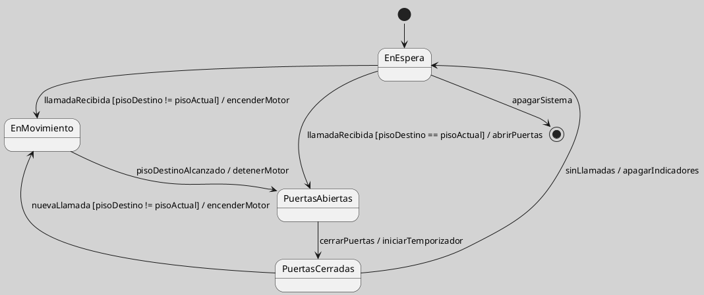

## Ejemplo de Ascensor como Máquina de Estados

Un ascensor permite introducir comportamiento reactivo, condiciones de movimiento y acciones de entrada o salida. Como ejemplo público y formativo, resulta útil porque muestra que un sistema aparentemente simple cambia su comportamiento según eventos, condiciones de seguridad y situación actual ([[Zk Ref omgUnifiedModelingLanguage2017|OMG, 2017]]).

La versión simplificada representa el ciclo básico: espera, movimiento, apertura y cierre de puertas. Una versión avanzada podría separar en regiones ortogonales el movimiento, las puertas, alarmas y sensores, pero esa ampliación debe reservarse para modelos donde esas dimensiones evolucionen de manera relativamente independiente ([[Zk Ref harelStatechartsVisualFormalism1987|Harel, 1987]]).

<!-- Para uso docente: este ejemplo es conveniente después de que el estudiante distingue estado, evento y guarda; si se presenta demasiado temprano, la concurrencia de puertas, motor y sensores puede distraer del núcleo conceptual. -->

**Figura**
*Ascensor como Máquina de Estados Simplificada*

*Nota*: La figura muestra una versión didáctica simple. No incluye sensores de seguridad, sobrecarga, emergencia ni concurrencia entre subsistemas.

### Enlaces Sugeridos

- [[Zk Estado Compuesto en UML|Estado Compuesto]]
- [[Zk Región Ortogonal en Máquina de Estados UML|Región Ortogonal]]
- [[Zk Criterios de Calidad de un Diagrama de Máquina de Estados UML|Criterios de Calidad]]
