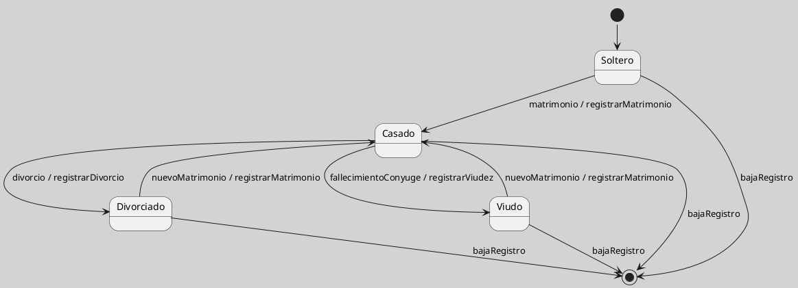

## Ejemplo de Estado Civil como Máquina de Estados

El estado civil puede usarse como ejemplo introductorio de máquina de estados porque permite reconocer estados relativamente familiares y transiciones provocadas por eventos significativos. Debe tratarse, sin embargo, como una simplificación conceptual del dominio y no como un modelo jurídico completo.

La utilidad del ejemplo reside en mostrar que una persona puede encontrarse en situaciones mutuamente diferenciables, como `Soltero`, `Casado`, `Divorciado` o `Viudo`, y que ciertos eventos producen cambios válidos entre esas situaciones. Desde el punto de vista UML, el ejemplo ilustra cómo un objeto o entidad puede tener un ciclo de vida modelable mediante estados y transiciones ([[Zk Ref boochLenguajeUnificadoModelado2006|Booch et al., 2006]]; [[Zk Ref omgUnifiedModelingLanguage2017|OMG, 2017]]).

### Límites del Ejemplo

- **Hecho consolidado**: el estado civil es una categoría social y jurídica usada en registros personales.
- **Interpretación didáctica**: puede modelarse como ciclo de vida simplificado para introducir estados y transiciones.
- **Límite conceptual**: el modelo no pretende describir toda la normativa paraguaya ni sus casos excepcionales.

<!-- Para uso docente: este ejemplo es útil para introducir la idea de transición, pero conviene advertir que la validez jurídica real depende del marco normativo y administrativo. -->

**Figura**
*Estado Civil como Máquina de Estados Simplificada*

*Nota*: El diagrama muestra una versión simplificada del cambio de estado civil; su finalidad es didáctica y no normativa.

### Enlaces Sugeridos

- [[Zk Diagrama de Máquina de Estados UML|Diagrama de Máquina de Estados UML]]
- [[Zk Estado en UML|Estado]]
- [[Zk Transición en Máquina de Estados UML|Transición]]
