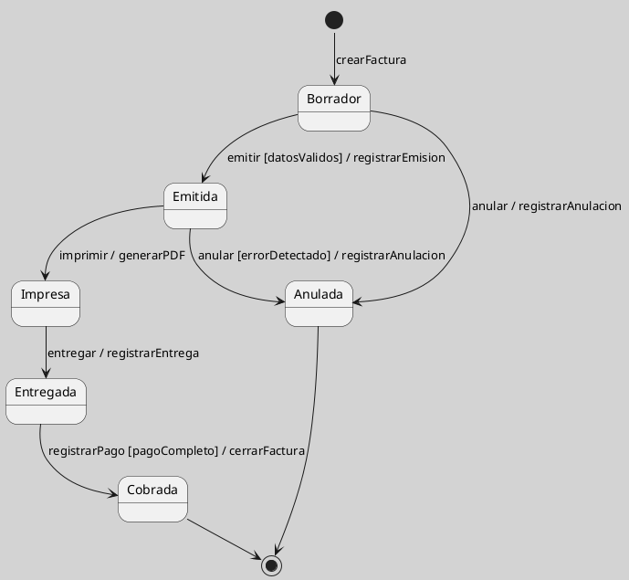

## Ejemplo de Factura CRM como Máquina de Estados

Una factura en un sistema CRM puede modelarse mediante una máquina de estados porque sus operaciones válidas dependen de su situación dentro del ciclo de vida. No se debería cobrar una factura inexistente, ni entregar una factura anulada, ni cerrar una factura sin registrar el pago correspondiente.

El ejemplo ilustra cómo las reglas de negocio pueden representarse como estados, transiciones, guardas y efectos. Esta forma de modelar es coherente con el uso de máquinas de estado UML para describir objetos cuyo comportamiento cambia durante su vida ([[Zk Ref boochLenguajeUnificadoModelado2006|Booch et al., 2006]]; [[Zk Ref omgUnifiedModelingLanguage2017|OMG, 2017]]).

<!-- Para uso docente: la versión anterior confundía una acción de carga o registro con una actividad de salida de estado; aquí se modela como efecto de una transición o como parte del ciclo de creación. -->

**Figura**
*Factura CRM como Máquina de Estados*

*Nota*: El diagrama representa una simplificación del ciclo de vida de una factura en un CRM. Los estados y transiciones pueden variar según reglas contables, fiscales o de negocio.

### Enlaces Sugeridos

- [[Zk Ciclo de Vida de un Objeto|Ciclo de Vida de un Objeto]]
- [[Zk Transición en Máquina de Estados UML|Transición]]
- [[Zk Criterios de Calidad de un Diagrama de Máquina de Estados UML|Criterios de Calidad]]
