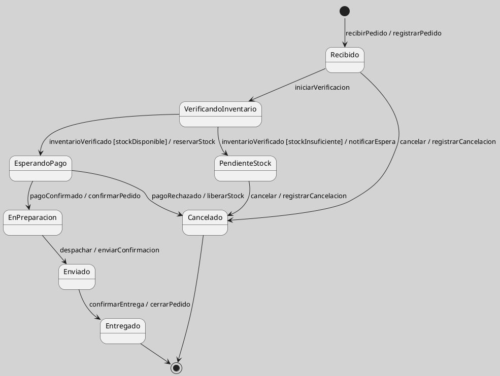

## Ejemplo de Pedido CRM como Máquina de Estados

Un pedido en un CRM es un buen ejemplo de comportamiento dependiente del estado porque integra reglas de inventario, pago, preparación, despacho, entrega y cancelación. Cada transición modifica las operaciones válidas posteriores y permite distinguir entre camino normal, excepciones y cancelaciones.

La versión revisada separa eventos, guardas y efectos para evitar expresiones ambiguas como “Inventario suficiente / Inventario insuficiente”, que mezclan condición y consecuencia. En UML, esta separación mejora la precisión del modelo porque distingue la ocurrencia que dispara la transición, la condición que la habilita y el comportamiento que se ejecuta como resultado ([[Zk Ref omgUnifiedModelingLanguage2017|OMG, 2017]]).

<!-- Para uso docente: este ejemplo permite conectar modelado de dominio, reglas de negocio y pruebas de transición. -->

**Figura**
*Pedido CRM como Máquina de Estados*

*Nota*: El diagrama modela el ciclo de vida simplificado de un pedido, incorporando alternativas por falta de stock, rechazo de pago y cancelación.

### Enlaces Sugeridos

- [[Zk Evento en Máquina de Estados UML|Evento]]
- [[Zk Guardia en Máquina de Estados UML|Guardia]]
- [[Zk Efecto de Transición en UML|Efecto]]
- [[Zk Pruebas Basadas en Máquinas de Estado|Pruebas Basadas en Máquinas de Estado]]
