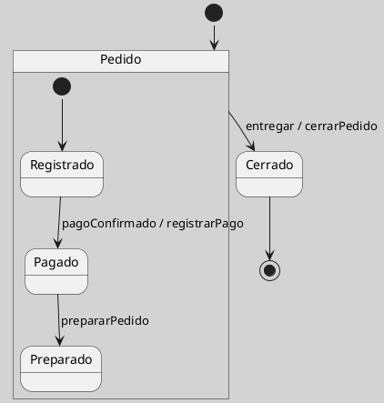

## Estado Compuesto en UML

Un estado compuesto es un estado que contiene una o más regiones internas con subestados. Su propósito es organizar comportamientos complejos sin convertir el diagrama en una red plana de transiciones difíciles de leer ([[Zk Ref boochLenguajeUnificadoModelado2006|Booch et al., 2006]]; [[Zk Ref omgUnifiedModelingLanguage2017|OMG, 2017]]).

La utilidad principal del estado compuesto es jerárquica: permite agrupar situaciones que comparten una lógica común y expresar transiciones de entrada o salida a nivel del grupo completo. Esta idea se vincula con la tradición de los statecharts, que introdujo jerarquía y composición para representar sistemas reactivos complejos de manera más manejable ([[Zk Ref harelStatechartsVisualFormalism1987|Harel, 1987]]).

<!-- Para uso docente: el ejemplo de pedido es deliberadamente simple; puede ampliarse con subestados de pago, preparación o entrega si se busca trabajar refinamiento progresivo. -->

**Figura**
*Estado Compuesto para un Pedido*

*Nota*: La figura muestra un estado compuesto `Pedido` que agrupa subestados internos antes de pasar al estado `Cerrado`.

### Enlaces Sugeridos

- [[Zk Estado en UML|Estado en UML]]
- [[Zk Región Ortogonal en Máquina de Estados UML|Región Ortogonal]]
- [[Zk Pseudoelementos de Máquina de Estados UML|Pseudoelementos]]
