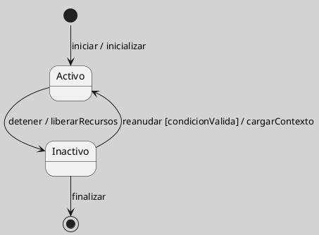

## Estado Inicial y Estado Final en UML

El pseudoelemento inicial indica el punto de entrada por defecto de una región de una máquina de estados. No representa un estado sustantivo del dominio, sino el lugar desde el cual comienza el recorrido cuando se activa la región ([[Zk Ref omgUnifiedModelingLanguage2017|OMG, 2017]]).

El estado final, en cambio, indica que se ha completado el comportamiento de una región o de la máquina de estados correspondiente. Por eso conviene no fusionar ambos conceptos bajo una misma explicación: uno expresa entrada inicial y el otro expresa terminación.

### Corrección Conceptual

Decir que el estado inicial “indica el inicio y final de la transición de estados” es impreciso. Lo correcto es distinguir entre un punto inicial, que marca el ingreso por defecto, y un estado final, que señala culminación del comportamiento modelado ([[Zk Ref omgUnifiedModelingLanguage2017|OMG, 2017]]).

- **Inicial**: punto de partida por defecto de una región.
- **Final**: punto de culminación del comportamiento dentro de una región o máquina.

<!-- Para uso docente: esta distinción suele corregir una confusión temprana frecuente entre símbolo inicial, estado final y transición. -->

**Figura**
*Estado Inicial, Estado Activo y Estado Final*

*Nota*: La figura muestra una secuencia mínima de activación, transición, reanudación condicionada y finalización.

### Enlaces Sugeridos

- [[Zk Estado en UML|Estado en UML]]
- [[Zk Transición en Máquina de Estados UML|Transición]]
- [[Zk Pseudoelementos de Máquina de Estados UML|Pseudoelementos]]
