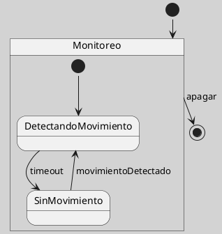

## Región Ortogonal en Máquina de Estados UML

Una región ortogonal permite que un estado compuesto contenga subcomportamientos activos en paralelo. En lugar de representar una única trayectoria interna, el modelo expresa que varias regiones pueden evolucionar simultáneamente y coordinarse mediante eventos, condiciones o sincronizaciones ([[Zk Ref omgUnifiedModelingLanguage2017|OMG, 2017]]).

En materiales introductorios suele hablarse de “regiones concurrentes”. Esa expresión es comprensible, pero el término técnico “región ortogonal” permite distinguir la concurrencia estructural dentro de un estado compuesto de una simple bifurcación visual. Esta posibilidad de representar concurrencia es una de las contribuciones históricas de los statecharts al modelado de sistemas reactivos ([[Zk Ref harelStatechartsVisualFormalism1987|Harel, 1987]]).

<!-- Para uso docente: antes de introducir regiones ortogonales, conviene que el estudiante ya comprenda estado compuesto y transición. -->

**Figura**
*Regiones Ortogonales en un Sistema de Monitoreo*

*Nota*: La figura representa dos regiones internas que evolucionan de forma simultánea: una vinculada al movimiento y otra a la temperatura.

### Riesgo de Modelado

No debe usarse una región ortogonal sólo para ahorrar espacio gráfico. Su empleo debe responder a la existencia de dimensiones de estado relativamente independientes y simultáneas.

### Enlaces Sugeridos

- [[Zk Estado Compuesto en UML|Estado Compuesto]]
- [[Zk Actividades Entry Exit y Do en UML|Actividades Entry, Exit y Do]]
- [[Zk Criterios de Calidad de un Diagrama de Máquina de Estados UML|Criterios de Calidad]]
