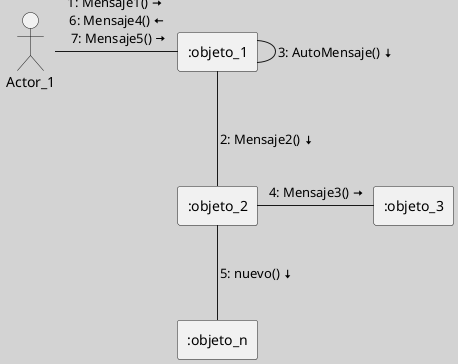
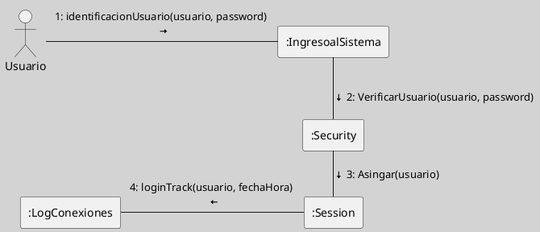

## Diagramas de Interacción (Diagrama de Comunicación)

Un **diagrama de comunicación UML** (anteriormente llamado diagrama de colaboración) es un tipo de diagrama de interacción que modela cómo los **objetos** y **actores** colaboran, mostrando explícitamente las **relaciones estructurales** (**enlaces**) entre ellos y el flujo de mensajes que intercambian para cumplir una función o caso de uso. A diferencia del diagrama de secuencia, el énfasis está en la organización espacial y las conexiones entre objetos, no en el orden temporal de los mensajes, aunque este se indica mediante numeración secuencial ([[050 Base de Conocimientos/900 Biblioteca/boochLenguajeUnificadoModelado2006/Zk Ref boochLenguajeUnificadoModelado2006|Booch et al., 2006]]; [[Zk Ref omgUnifiedModelingLanguage2017|OMG, 2017]]; [[Zk Ref pressmanIngenieriaSoftwareEnfoque2013|Pressman, 2013]]; [[Zk Ref rumbaughLenguajeUnificadoModelado2007|Rumbaugh et al., 2007]]).

### Casos de Uso de Aplicación

Los diagramas de  comunicación se emplean para ([[050 Base de Conocimientos/900 Biblioteca/boochLenguajeUnificadoModelado2006/Zk Ref boochLenguajeUnificadoModelado2006|Booch et al., 2006]]; [[Zk Ref pressmanIngenieriaSoftwareEnfoque2013|Pressman, 2013]]; [[Zk Ref rumbaughLenguajeUnificadoModelado2007|Rumbaugh et al., 2007]]):

- Visualizar la estructura de colaboración entre objetos en la ejecución de un escenario o caso de uso.
- Analizar y documentar cómo los objetos están conectados y cómo fluyen los mensajes a través de dichos enlaces.
- Identificar dependencias y relaciones entre componentes, facilitando el diseño de arquitecturas desacopladas.
- Complementar diagramas de secuencia, proporcionando una visión estructural de las interacciones, útil para detectar redundancias o acoplamientos excesivos.

### Elementos Principales

| Elemento            | Descripción                                                                             |
| ------------------- | --------------------------------------------------------------------------------------- |
| Actor               | Usuario o sistema externo que interactúa con el sistema.                                |
| Objeto/Participante | Instancia que participa en la colaboración (rectángulo con nombre subrayado o tipo).    |
| Enlace/Conector     | Línea que representa una relación estructural (asociación, enlace) entre objetos.       |
| Mensaje             | Flecha sobre el enlace, etiquetada con número secuencial y nombre del mensaje.          |
| Número de secuencia | Indica el orden de los mensajes (1, 2, etc.), esencial para comprender el flujo lógico. |
| Notas               | Comentarios o aclaraciones sobre elementos o interacciones.                             |

### Ejemplos

### Ejemplo 1

**Figura**
_Ejemplo Genérico de Diagrama de Comunicación_

Nota:
- Elaboración Propia, usando la herramienta [[Zk (Plantuml) Herramienta para crear Diagramas a Partir de Texto|Plantuml]].
- Este diagrama es la versión equivalente a:

![[Zk Diagramas de Interacción (Diagrama de Secuencia)#Ejemplo 1]]

#### Ejemplo 2

**Figura**
_Ejemplo Básico Diagrama de Comunicación de un Esquema de Autenticación de Usuario_

Nota:
- Elaboración Propia, usando la herramienta [[Zk (Plantuml) Herramienta para crear Diagramas a Partir de Texto|Plantuml]]. 
- Este diagrama es la versión equivalente a:

![[Zk Diagramas de Interacción (Diagrama de Secuencia)#Ejemplo 2]]
