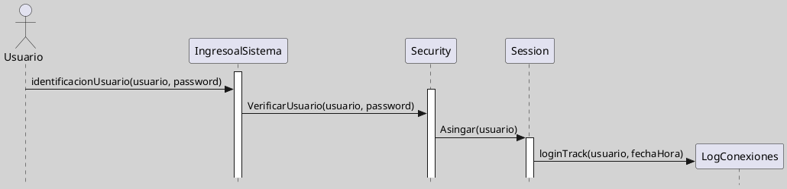

## Diagramas de Interacción (Diagrama de Secuencia)

Un **diagrama de secuencia UML** es un tipo de [[Zk Diagramas de Interacción (Introducción)|diagrama de interacción]] que representa cómo los [[Zk Modelo Conceptual del UML (Diagrama de Objetos)|objetos]] de un sistema colaboran a través del intercambio de mensajes en un **orden temporal específico** para cumplir una función o [[Zk Diagrama de Casos de Uso - Elementos (Caso de Uso)|caso de uso]]. Su **eje vertical** representa el tiempo, y el **eje horizontal** los **participantes** (**objetos** o **actores**). El diagrama muestra explícitamente la secuencia de mensajes y las activaciones de los objetos involucrados ([[050 Base de Conocimientos/900 Biblioteca/boochLenguajeUnificadoModelado2006/Zk Ref boochLenguajeUnificadoModelado2006|Booch et al., 2006]]; [[Zk Ref omgUnifiedModelingLanguage2017|OMG, 2017]]; [[Zk Ref pressmanIngenieriaSoftwareEnfoque2013|Pressman, 2013]]; [[Zk Ref rumbaughLenguajeUnificadoModelado2007|Rumbaugh et al., 2007]]).

### Casos de Uso de Aplicación

Los diagramas de secuencia se utilizan para ([[050 Base de Conocimientos/900 Biblioteca/boochLenguajeUnificadoModelado2006/Zk Ref boochLenguajeUnificadoModelado2006|Booch et al., 2006]]; [[Zk Ref pressmanIngenieriaSoftwareEnfoque2013|Pressman, 2013]]; [[Zk Ref rumbaughLenguajeUnificadoModelado2007|Rumbaugh et al., 2007]]):

- Modelar escenarios detallados de casos de uso, describiendo cómo los objetos interactúan paso a paso.
- Analizar y documentar el comportamiento dinámico de sistemas orientados a objetos.
- Identificar responsabilidades de clases y colaborar en el diseño de la arquitectura.
- Visualizar flujos de eventos, condiciones, bucles, creación y destrucción de objetos.
- Detectar posibles errores de diseño, como dependencias innecesarias o acoplamientos excesivos

### Elementos Principales

| Elemento              | Descripción                                                                                |
| --------------------- | ------------------------------------------------------------------------------------------ |
| Actor                 | Representa un usuario o sistema externo.                                                   |
| Participante/Objeto   | Entidad que participa en la interacción.                                                   |
| Línea de vida         | Línea vertical que indica la existencia del objeto durante la interacción.                 |
| Mensaje               | Flecha horizontal que indica el envío de un mensaje.                                       |
| Activación            | Barra vertical sobre la línea de vida, indica ejecución de una operación.                  |
| Retorno               | Flecha punteada que indica el retorno de un mensaje.                                       |
| Creación de objeto    | Flecha con etiqueta `create` hacia un nuevo participante.                                  |
| Destrucción de objeto | Una 'X' al final de la línea de vida.                                                      |
| Marcos de interacción | Rectángulos que agrupan mensajes bajo condiciones (Alternativa `alt`, Ciclo `loop`, etc.). |
| Notas                 | Comentarios o aclaraciones sobre elementos o interacciones.                                |

### Ejemplos

#### Ejemplo 1
**Figura**
_Ejemplo Genérico de Diagrama de Secuencia_


```plantuml-code
!pragma layout smetana
skinparam style strictuml
skinparam classAttributeIconSize 0
skinparam BackgroundColor LightGray
'left to right direction
'top to bottom direction
skinparam linetype ortho
scale 0.8

'Actores
Actor Actor_1
Activate Actor_1
note over Actor_1: Actor

'Objetos

participant ":objeto_1" as objeto1
note over objeto1: Participante\nu Objeto

participant ":objeto_2" as objeto2
participant ":objeto_3" as objeto3
participant ":objeto_4" as objeton

Actor_1 -> objeto1 :mensaje1()

activate objeto1
note right: Activación
objeto1 -> objeto2 : mensaje2()

activate objeto2

objeto1 -> objeto1 : AutoMensaje()
deactivate objeto1

objeto2 -> objeto3 : mensaje3()

activate objeto3

return retornoDelMensaje3()

create objeton

objeto2 -> objeton : nuevo()

activate objeton

destroy objeto2
note right: Destrucción\ndel Objeto

Activate objeto1
Actor_1 <- objeto1 :mensaje4()
Actor_1 -> objeto1 : mensaje5()

@enduml
```
_Nota_: Elaboración Propia, usando la herramienta [[Zk (Plantuml) Herramienta para crear Diagramas a Partir de Texto|Plantuml]].

---
#### Ejemplo 2
**Figura**
_Ejemplo Básico Diagrama de Secuencia de un Esquema de Autenticación de Usuario_



_Nota_: Elaboración Propia, usando la herramienta [[Zk (Plantuml) Herramienta para crear Diagramas a Partir de Texto|Plantuml]].

---
#### Ejemplo 3
![[Zk Modelo Conceptual del UML (Diagrama de Secuencia)#Escenario Avanzado]]
Nota: Elaboración Propia, usando la herramienta [[Zk (Plantuml) Herramienta para crear Diagramas a Partir de Texto|Plantuml]].
