## Diagramas de Interacción y el SDLC

El desarrollo de [[Zk Diagramas de Interacción (Introducción)|diagramas de interacción]] (como los de [[Zk Diagramas de Interacción (Diagrama de Secuencia)|secuencia]] o [[Zk Diagramas de Interacción (Diagrama de Comunicación)|comunicación]]) suele surgir de forma natural a partir de los [[Zk Diagrama de Casos de Uso - Elementos (Caso de Uso)|casos de uso]] y sus [[Zk Diagrama de Casos de Uso - Elementos (Caso de Uso, Especificación)|descripciones textuales]]. Un camino común y efectivo consiste en:

1. Identificar un **caso de uso** específico.
2. Analizar sus escenarios (flujos principal y alternativos).
3. Utilizar el diagrama de **clases** asociado para determinar los **objetos participantes**.
4. Construir el diagrama de interacción, modelando cómo los objetos colaboran para cumplir el comportamiento descrito.

Este enfoque no es el único posible, pero suele ser el más directo y sistemático dentro del **Ciclo de Vida del Desarrollo de Software (SDLC)**, ya que vincula de forma coherente los requisitos funcionales con el diseño dinámico del sistema.

Figura
_El Camino Natural para Llegar a los Diagramas de Interacción_
![[Zk Diagramas de Interacción (Introducción).png]]

### Diagramas de Interacción y Diagramas de Clase

Los [[Zk Diagramas de Interacción (Introducción)|diagramas de interacción]] (como los de [[Zk Diagramas de Interacción (Diagrama de Secuencia)|secuencia]] o [[Zk Diagramas de Interacción (Diagrama de Comunicación)|comunicación]]) también cumplen una función crucial en el análisis y diseño orientado a objetos, ya que permiten **identificar, validar y refinar las operaciones definidas en las clases**.

Esto se debe a que **cada mensaje enviado entre objetos en un diagrama de interacción representa una posible operación en la clase del objeto receptor**. Por ejemplo:

- Supongamos que `:objeto1` es una instancia de `Clase1`.
- Y que `:objeto2` es una instancia de `Clase2`.
- Si `:objeto1` envía un mensaje `m1()` a `:objeto2`, entonces **la clase `Clase2` debe definir una operación `m1()`** que pueda ser invocada por ese mensaje.

Este análisis permite **alinear el comportamiento dinámico del sistema con la estructura estática definida en el diagrama de clases**, y detectar posibles inconsistencias, operaciones faltantes o mal diseñadas.

**Figura**
_Diagrama de Interacción (Secuencia)_

```plantuml-code
@startuml
!pragma layout smetana
skinparam style strictuml
skinparam classAttributeIconSize 0
skinparam BackgroundColor LightGray
'left to right direction
'top to bottom direction
skinparam linetype ortho
scale 1

participant ":objeto1" as objeto1
activate objeto1

participant ":objeto2" as objeto2
activate objeto2

objeto1 -> objeto2 :m()
@enduml
```

**Figura**
_Diagrama de Clase Asociado al de Interacción_

```plantuml-code
@startuml
!pragma layout smetana
skinparam style strictuml
skinparam classAttributeIconSize 0
skinparam BackgroundColor LightGray
left to right direction
'top to bottom direction
skinparam linetype ortho
scale 1

class Clase1
class Clase2 {
...
+m()
}

Clase1 ----> Clase2

@enduml
```

**Figura**
_Un Ejemplo más Amplio_
![[Zk Diagramas de Interacción (Diagramas de Interacción y el SDLS).png]]
